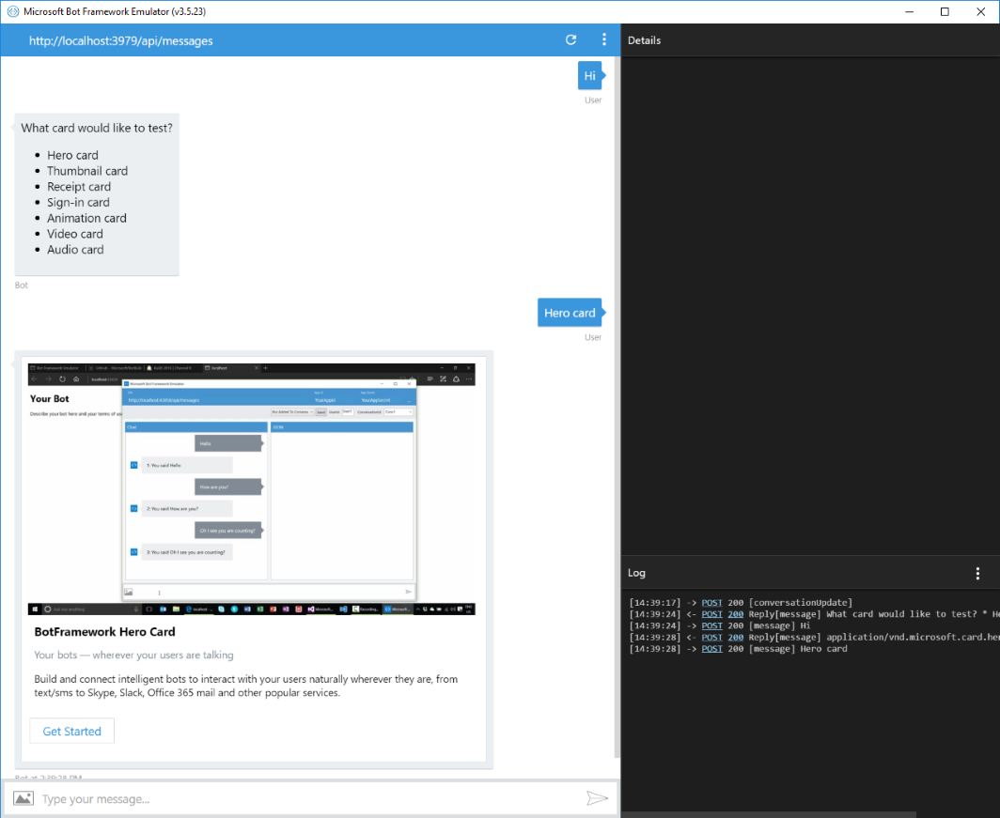
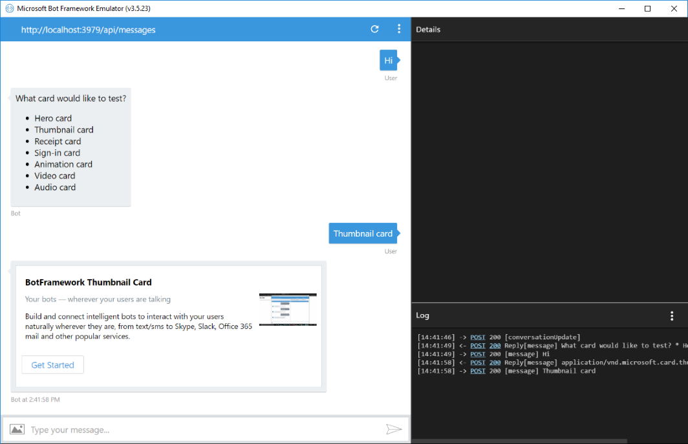
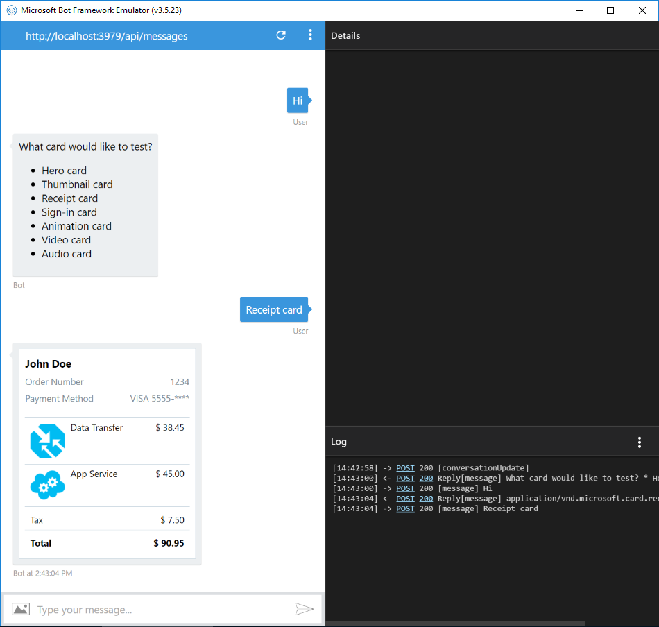
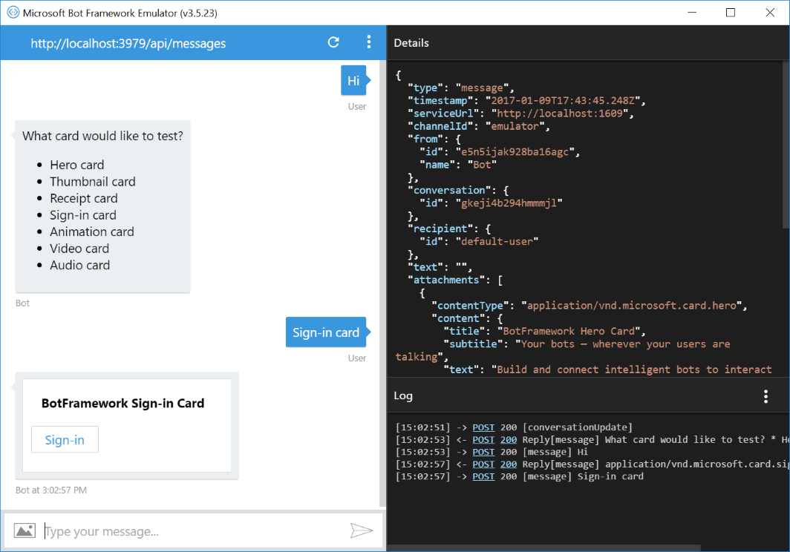

# Rich Cards Bot Sample

A sample bot to renders several types of cards as attachments.

[![Deploy to Azure][Deploy Button]][Deploy CSharp/RichCards]
[Deploy Button]: https://azuredeploy.net/deploybutton.png
[Deploy CSharp/RichCards]: https://azuredeploy.net

### Prerequisites

The minimum prerequisites to run this sample are:
* The latest update of Visual Studio 2015. You can download the community version [here](http://www.visualstudio.com) for free.
* The Bot Framework Emulator. To install the Bot Framework Emulator, download it from [here](https://emulator.botframework.com/). Please refer to [this documentation article](https://github.com/microsoft/botframework-emulator/wiki/Getting-Started) to know more about the Bot Framework Emulator.

### Code Highlights

Many messaging channels provide the ability to attach richer objects. The Bot Framework has the ability to render rich cards as attachments. There are several types of cards supported: Hero Card, Thumbnail Card, Receipt Card, Sign-In Card, Animation Card, Video Card and Audio Card. Once the desired Card type is selected, it is mapped into an `Attachment` data structure. Check out the key code located in the [CardsDialog](CardsDialog.cs#L46-L51) class where the `message.Attachments` property of the message activity is populated with a card attachment.

````C#
public async Task DisplaySelectedCard(IDialogContext context, IAwaitable<string> result)
{
    var selectedCard = await result;

    var message = context.MakeMessage();

    var attachment = GetSelectedCard(selectedCard);
    message.Attachments.Add(attachment);

    await context.PostAsync(message);

    context.Wait(this.MessageReceivedAsync);
}
````

#### Hero Card

The Hero card is a multipurpose card; it primarily hosts a single large image, a button, and a "tap action", along with text content to display on the card. Check out the `GetHeroCard` method in the [CardsDialog](CardsDialog.cs#L78-L90) class for a Hero Card sample.

````C#
private static Attachment GetHeroCard()
{
    var heroCard = new HeroCard
    {
        Title = "BotFramework Hero Card",
        Subtitle = "Your bots — wherever your users are talking",
        Text = "Build and connect intelligent bots to interact with your users naturally wherever they are, from text/sms to Skype, Slack, Office 365 mail and other popular services.",
        Images = new List<CardImage> { new CardImage("https://sec.ch9.ms/ch9/7ff5/e07cfef0-aa3b-40bb-9baa-7c9ef8ff7ff5/buildreactionbotframework_960.jpg") },
        Buttons = new List<CardAction> { new CardAction(ActionTypes.OpenUrl, "Get Started", value: "https://docs.botframework.com/en-us/") }
    };

    return heroCard.ToAttachment();
}
````

#### Thumbnail Card
The Thumbnail card is a multipurpose card; it primarily hosts a single small image, a button, and a "tap action", along with text content to display on the card. Check out the `GetThumbnailCard` method in the [CardsDialog](CardsDialog.cs#L92-L104) class for a Thumbnail Card sample.

````C#
private static Attachment GetThumbnailCard()
{
    var heroCard = new ThumbnailCard
    {
        Title = "BotFramework Thumbnail Card",
        Subtitle = "Your bots — wherever your users are talking",
        Text = "Build and connect intelligent bots to interact with your users naturally wherever they are, from text/sms to Skype, Slack, Office 365 mail and other popular services.",
        Images = new List<CardImage> { new CardImage("https://sec.ch9.ms/ch9/7ff5/e07cfef0-aa3b-40bb-9baa-7c9ef8ff7ff5/buildreactionbotframework_960.jpg") },
        Buttons = new List<CardAction> { new CardAction(ActionTypes.OpenUrl, "Get Started", value: "https://docs.botframework.com/en-us/") }
    };

    return heroCard.ToAttachment();
}
````

#### Receipt Card
The receipt card allows the Bot to present a receipt to the user. Check out the `GetReceiptCard` method in the [CardsDialog](CardsDialog.cs#L106-L130) class for a Receipt Card sample.

````C#
private static Attachment GetReceiptCard()
{
    var receiptCard = new ReceiptCard
    {
        Title = "John Doe",
        Facts = new List<Fact> { new Fact("Order Number", "1234"), new Fact("Payment Method", "VISA 5555-****") },
        Items = new List<ReceiptItem>
        {
            new ReceiptItem("Data Transfer", price: "$ 38.45", quantity: "368", image: new CardImage(url: "https://github.com/amido/azure-vector-icons/raw/master/renders/traffic-manager.png")),
            new ReceiptItem("App Service", price: "$ 45.00", quantity: "720", image: new CardImage(url: "https://github.com/amido/azure-vector-icons/raw/master/renders/cloud-service.png")),
        },
        Tax = "$ 7.50",
        Total = "$ 90.95",
        Buttons = new List<CardAction>
        {
            new CardAction(
                ActionTypes.OpenUrl,
                "More information",
                "https://account.windowsazure.com/content/6.10.1.38-.8225.160809-1618/aux-pre/images/offer-icon-freetrial.png",
                "https://azure.microsoft.com/en-us/pricing/")
        }
    };

    return receiptCard.ToAttachment();
}
````

#### Sign-In Card
The Sign-In card is a card representing a request to sign in the user. Check out the `GetSigninCard` method in the [CardsDialog](CardsDialog.cs#L132-L141) class for a Sign-In Card sample.

> Note: The sign in card can be used to initiate an authentication flow which is beyond this sample. For a complete authentication flow sample take a look at [AuthBot](https://github.com/MicrosoftDX/AuthBot).

````C#
private static Attachment GetSigninCard()
{
    var signinCard = new SigninCard
    {
        Text = "BotFramework Sign-in Card",
        Buttons = new List<CardAction> { new CardAction(ActionTypes.Signin, "Sign-in", value: "https://login.microsoftonline.com/") }
    };

    return signinCard.ToAttachment();
}
````

#### Animation Card
The Animation card is a card that’s capable of playing animated GIFs or short videos. Check out the `GetAnimationCard` method in the [CardsDialog](CardsDialog.cs#L143-L161) class for an Animation Card sample.

````C#
private static Attachment GetAnimationCard()
{
    var currentUrl = HttpContext.Current.Request.Url;

    var animationCard = new AnimationCard
    {
        Title = "Microsoft Bot Framework",
        Subtitle = "Animation Card",
        Media = new List<MediaUrl>()
        {
            new MediaUrl()
            {
                Url = new UriBuilder(currentUrl.Scheme, currentUrl.Host, currentUrl.Port, "/images/botframework.gif").ToString()
            }
        }
    };

    return animationCard.ToAttachment();
}
````

#### Video Card
The Video card is a card that’s capable of playing videos. Check out the `GetVideoCard` method in the [CardsDialog](CardsDialog.cs#L163-L191) class for a Video Card sample.

````C#
private static Attachment GetVideoCard()
{
    var currentUrl = HttpContext.Current.Request.Url;

    var videoCard = new VideoCard
    {
        Title = "Microsoft Bot Framework and how we created the Azure Bot",
        Subtitle = "by Thiago Almeida",
        Text = "At Microsoft, we have first-hand experience writing bots and building artificial intelligence systems, so we’ve shared our services and tools so you can use them to add conversations to your own products. In this session we will cover the Microsoft Bot Framework and it's three components: the Microsoft Cognitive Services, the Bot Builder SDK, and the Bot Connector. We will also show the code and details about the Azure Bot and how it was built.",
        Media = new List<MediaUrl>()
        {
            new MediaUrl()
            {
                Url = "http://video.ch9.ms/ch9/15ec/8933d06d-a6cd-460b-8a52-245ab52515ec/BotFramework_mid.mp4"
            }
        },
        Buttons = new List<CardAction>()
        {
            new CardAction()
            {
                Title = "See more in Channel9",
                Type = ActionTypes.OpenUrl,
                Value = "https://channel9.msdn.com/events/TechDays/Techdays-2016-The-Netherlands/Microsoft-Bot-Framework-and-how-we-created-the-Azure-Bot"
            }
        }
    };

    return videoCard.ToAttachment();
}
````

#### Audio Card
The Audio card is a card that’s capable of playing an audio file. Check out the `GetAudioCard` method in the [CardsDialog](CardsDialog.cs#L193-L221) class for an Audio Card sample.

````C#
private static Attachment GetVideoCard()
{
    var currentUrl = HttpContext.Current.Request.Url;

    var videoCard = new VideoCard
    {
        Title = "Microsoft Bot Framework and how we created the Azure Bot",
        Subtitle = "by Thiago Almeida",
        Text = "At Microsoft, we have first-hand experience writing bots and building artificial intelligence systems, so we’ve shared our services and tools so you can use them to add conversations to your own products. In this session we will cover the Microsoft Bot Framework and it's three components: the Microsoft Cognitive Services, the Bot Builder SDK, and the Bot Connector. We will also show the code and details about the Azure Bot and how it was built.",
        Media = new List<MediaUrl>()
        {
            new MediaUrl()
            {
                Url = "http://video.ch9.ms/ch9/15ec/8933d06d-a6cd-460b-8a52-245ab52515ec/BotFramework_mid.mp4"
            }
        },
        Buttons = new List<CardAction>()
        {
            new CardAction()
            {
                Title = "See more in Channel9",
                Type = ActionTypes.OpenUrl,
                Value = "https://channel9.msdn.com/events/TechDays/Techdays-2016-The-Netherlands/Microsoft-Bot-Framework-and-how-we-created-the-Azure-Bot"
            }
        }
    };

    return videoCard.ToAttachment();
}
````

### Outcome

You will see the following in the Bot Framework Emulator, Facebook Messenger and Skype when opening and running the sample.

#### Hero Card

| Emulator | Facebook | Skype |
|----------|-------|----------|
||||

#### Thumbnail Card

| Emulator | Facebook | Skype |
|----------|-------|----------|
||||

#### Receipt Card

| Emulator | Facebook | Skype |
|----------|-------|----------|
||||

#### Sign-In Card

| Emulator | Facebook | Skype |
|----------|-------|----------|
||||

### More Information

To get more information about how to get started in Bot Builder for .NET and Attachments please review the following resources:
* [Bot Builder for .NET](https://docs.botframework.com/en-us/csharp/builder/sdkreference/index.html)
* [Adding Attachments to a Message](https://docs.botframework.com/en-us/core-concepts/attachments)
* [Attachments Property](https://docs.botframework.com/en-us/csharp/builder/sdkreference/activities.html#attachmentsproperty)
* [Attachments, Cards and Actions](https://docs.botframework.com/en-us/csharp/builder/sdkreference/attachments.html)

> **Limitations**  
> The functionality provided by the Bot Framework Activity can be used across many channels. Moreover, some special channel features can be unleashed using the [ChannelData property](https://docs.botframework.com/en-us/csharp/builder/sdkreference/channels.html).
> 
> The Bot Framework does its best to support the reuse of your Bot in as many channels as you want. However, due to the very nature of some of these channels, some features are not fully portable.
> 
> The features used in this sample are fully supported in the following channels:
> - Skype
> - Facebook
> - Telegram
> - DirectLine
> - WebChat
> - Slack
> - Email
> - GroupMe
> 
> They are also supported, with some limitations, in the following channel:
> - Kik
> 
> On the other hand, they are not supported and the sample won't work as expected in the following channel:
> - SMS
