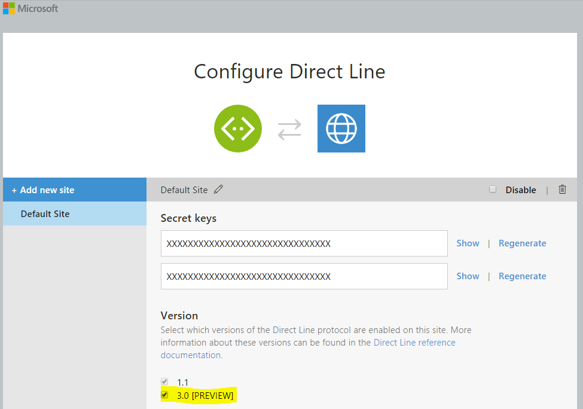
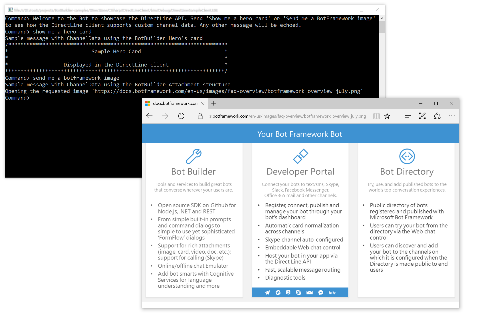

# Direct Line Bot Sample

A sample bot and a custom client communicating to each other using the Direct Line API and WebSockets.

[![Deploy to Azure][Deploy Button]][Deploy DirectLine/CSharp]
[Deploy Button]: https://azuredeploy.net/deploybutton.png
[Deploy DirectLine/CSharp]: https://azuredeploy.net

### Prerequisites

The minimum prerequisites to run this sample are:
* The latest update of Visual Studio 2015. You can download the community version [here](http://www.visualstudio.com) for free.
* The Bot Framework Emulator. To install the Bot Framework Emulator, download it from [here](https://emulator.botframework.com/). Please refer to [this documentation article](https://github.com/microsoft/botframework-emulator/wiki/Getting-Started) to know more about the Bot Framework Emulator.
* Register your bot with the Microsoft Bot Framework. Please refer to [this](https://docs.botframework.com/en-us/csharp/builder/sdkreference/gettingstarted.html#registering) for the instructions. Once you complete the registration, update the [Bot's Web.config](DirectLineBot/Web.config#L9-L11) file with the registered config values (Bot Id, MicrosoftAppId and MicrosoftAppPassword)

#### Direct Line API
Credentials for the Direct Line API must be obtained from the Bot Framework developer portal, and will only allow the caller to connect to the bot for which they were generated.
In the Bot Framework developer portal, enable Direct Line in the channels list and then, configure the Direct Line secret and update its value in the [client's App.config](DirectLineClient/App.config#L4-L5) file alongside with the Bot Id. Make sure that the checkbox for version 3.0 [PREVIEW] is checked. Refer to [this](https://docs.botframework.com/en-us/csharp/builder/sdkreference/gettingstarted.html#channels) for more information on how to configure channels.

#### Publish
Also, in order to be able to run and test this sample you must [publish your bot, for example to Azure](https://docs.botframework.com/en-us/csharp/builder/sdkreference/gettingstarted.html#publishing). Alternatively, you can use [Ngrok to interact with your local bot in the cloud](https://blogs.msdn.microsoft.com/jamiedalton/2016/07/29/ms-bot-framework-ngrok/). 

### Code Highlights

<TBA>

### Outcome

To run the sample, you'll need to run both Bot and Client apps.
* Running Bot app
    1. In the Visual Studio Solution Explorer window, right click on the **DirectLineBot** project.
    2. In the contextual menu, select Debug, then Start New Instance and wait for the _Web application_ to start.
* Running Client app
    1. In the Visual Studio Solution Explorer window, right click on the **DirectLineSampleClient** project.
    2. In the contextual menu, select Debug, then Start New Instance and wait for the _Console application_ to start.

To test the Attachments type `show me a hero card` or `send me a botframework image` and you should see the following outcome.

### More Information

To get more information about how to get started in Bot Builder for .NET and Conversations please review the following resources:
* [Bot Builder for .NET](https://docs.botframework.com/en-us/csharp/builder/sdkreference/index.html)
* [Bot Framework FAQ](https://docs.botframework.com/en-us/faq/#i-have-a-communication-channel-id-like-to-be-configurable-with-bot-framework-can-i-work-with-microsoft-to-do-that)
* [Direct Line API - v3.0](https://docs.botframework.com/en-us/restapi/directline3/)
* [Direct Line v3.0 Nuget package](https://www.nuget.org/packages/Microsoft.Bot.Connector.DirectLine/3.0.0-beta)
* [Adding Attachments to a Message](https://docs.botframework.com/en-us/core-concepts/attachments)
* [Bot Framework Emulator](https://github.com/microsoft/botframework-emulator/wiki/Getting-Started)
