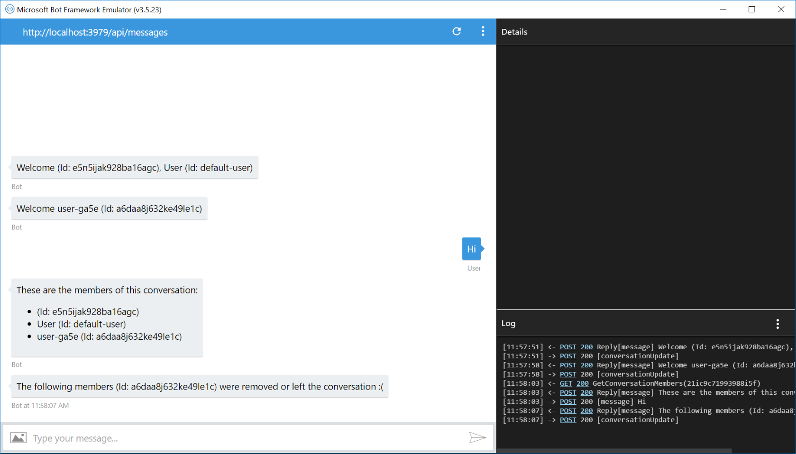

# Get Conversation Members Bot Sample

A sample bot that retrieves the conversation's members list and detects when it changes.

[![Deploy to Azure][Deploy Button]][Deploy CSharp/GetConversationMembers]
[Deploy Button]: https://azuredeploy.net/deploybutton.png
[Deploy CSharp/GetConversationMembers]: https://azuredeploy.net

### Prerequisites

The minimum prerequisites to run this sample are:
* The latest update of Visual Studio 2015. You can download the community version [here](http://www.visualstudio.com) for free.
* The Bot Framework Emulator. To install the Bot Framework Emulator, download it from [here](https://emulator.botframework.com/). Please refer to [this documentation article](https://github.com/microsoft/botframework-emulator/wiki/Getting-Started) to know more about the Bot Framework Emulator.

### Code Highlights

#### Detecting when members leave or join a group conversation

Your bot often needs to know when the state of the conversation it's in has changed. This may represent the bot being added to the conversation, or a person added or remove from the chat. When these changes happen, your bot will receive a conversationUpdate Activity.
In this event, the MembersAdded and MembersRemoved lists will contain the changes to the conversation since the last event. Both properties contain an array of [`ChannelAccount`](https://docs.botframework.com/en-us/csharp/builder/sdkreference/d9/d4d/_channel_account_8cs_source.html) used to represent an address a user or bot on a communication channel.
Check out the [GetConversationMembersDialog.cs](GetConversationMembersDialog.cs#L23-L45) class handling the `ConversationUpdate` Activity type.

````C#
if (activity.Type == ActivityTypes.ConversationUpdate)
{
    if (activity.MembersAdded != null && activity.MembersAdded.Any())
    {
        string membersAdded = string.Join(
            ", ", 
            activity.MembersAdded.Select(
                newMember => (newMember.Id != activity.Recipient.Id) ? $"{newMember.Name} (Id: {newMember.Id})" 
                                : $"{activity.Recipient.Name} (Id: {activity.Recipient.Id})"));

        await context.PostAsync($"Welcome {membersAdded}");
    }

    if (activity.MembersRemoved != null && activity.MembersRemoved.Any())
    {
        string membersRemoved = string.Join(
            ", ", 
            activity.MembersRemoved.Select(
                removedMember => (removedMember.Id != activity.Recipient.Id) ? $"{removedMember.Name} (Id: {removedMember.Id})" : string.Empty));

        await context.PostAsync($"The following members {membersRemoved} were removed or left the conversation :(");
    }
}
````

#### Retrieving the member's list using the Bot Connector's REST API

To enumerate the members of a conversation you can use the `GetConversationMembers` method from the Bot Connector class. This method returns an array of [`ChannelAccount`](https://docs.botframework.com/en-us/csharp/builder/sdkreference/d9/d4d/_channel_account_8cs_source.html) objects which are the members of the conversation.
Check out the [GetConversationMembersDialog.cs](GetConversationMembersDialog.cs#L47-L62) class using the `GetConversationMembersAsync` method to list the Conversation members.

````C#
if (activity.Type == ActivityTypes.Message)
{
    using (var scope = DialogModule.BeginLifetimeScope(Conversation.Container, activity))
    {
        var client = scope.Resolve<IConnectorClient>();
        var activityMembers = await client.Conversations.GetConversationMembersAsync(activity.Conversation.Id);

        string members = string.Join(
            "\n ", 
            activityMembers.Select(
                member => (member.Id != activity.Recipient.Id) ? $"* {member.Name} (Id: {member.Id})"
                            : $"* {activity.Recipient.Name} (Id: {activity.Recipient.Id})"));

        await context.PostAsync($"These are the members of this conversation: \n {members}");
    }
}
````

### Outcome

You will see the following in the Bot Framework Emulator when opening and running the sample solution.



You will see the following in Slack.


On the other hand, you will see the following in Skype.


### More Information

To get more information about how to get started in Bot Builder for .NET and Activities please review the following resources:
* [Bot Builder for .NET](https://docs.botframework.com/en-us/csharp/builder/sdkreference/index.html)
* [Activities](https://docs.botframework.com/en-us/csharp/builder/sdkreference/activities.html)
* [Conversation Update](https://docs.botframework.com/en-us/csharp/builder/sdkreference/activities.html#conversationUpdate)
* [ConversationExtensions](https://docs.botframework.com/en-us/csharp/builder/sdkreference/d7/d08/class_microsoft_1_1_bot_1_1_connector_1_1_conversations_extensions.html)

> **Limitations**  
> The functionality provided by the Bot Framework Activity can be used across many channels. Moreover, some special channel features can be unleashed using the [ChannelData property](https://docs.botframework.com/en-us/csharp/builder/sdkreference/channels.html).
> 
> The Bot Framework does its best to support the reuse of your Bot in as many channels as you want. However, due to the very nature of some of these channels, some features are not fully portable.
> 
> The features used in this sample are fully supported in the following channels:
> - Skype
> - Slack
> - DirectLine
> - WebChat
> - SMS
> - Kik
> - Email
> - GroupMe
>
> They are also supported, with some limitations, in the following channels:
> - Facebook
> - Microsoft Teams
>
> On the other hand, they are not supported and the sample won't work as expected in the following channel:
> - Telegram
