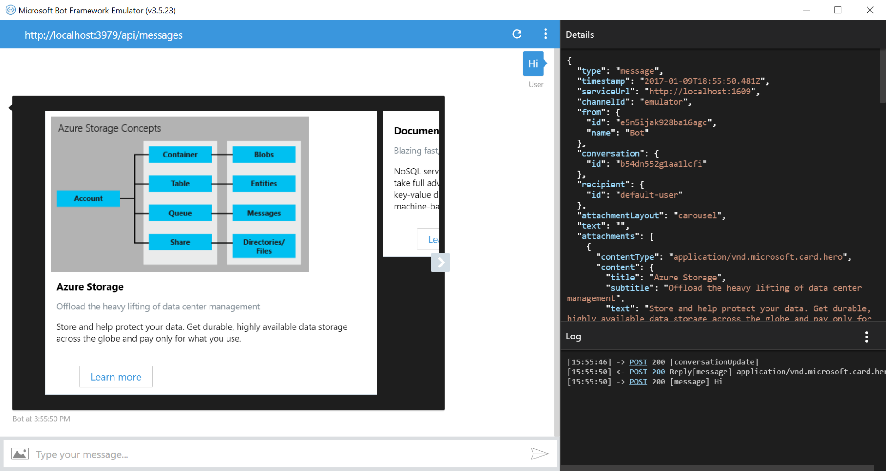

# Carousel of Cards Bot Sample

A sample bot that sends multiple rich card attachments in a single message using the Carousel layout.

[![Deploy to Azure][Deploy Button]][Deploy CarouselCards/Node]
[Deploy Button]: https://azuredeploy.net/deploybutton.png
[Deploy CarouselCards/Node]: https://azuredeploy.net

### Prerequisites

The minimum prerequisites to run this sample are:
* Latest Node.js with NPM. Download it from [here](https://nodejs.org/en/download/).
* The Bot Framework Emulator. To install the Bot Framework Emulator, download it from [here](https://emulator.botframework.com/). Please refer to [this documentation article](https://github.com/microsoft/botframework-emulator/wiki/Getting-Started) to know more about the Bot Framework Emulator.
* **[Recommended]** Visual Studio Code for IntelliSense and debugging, download it from [here](https://code.visualstudio.com/) for free.

### Code Highlights

You can send multiple rich card attachments in a single message. On most channels they will be sent as a list of rich cards, but some channels (like Skype and Facebook) can render them as a carousel of rich cards. The `Message.attachmentLayout()` method allows you to control how the rich cards will be rendered. Check out the key code located in [app.js](app.js#L24) class where the attachments layout is changed to the Carousel mode.


> Note: Only the [Hero](https://docs.botframework.com/en-us/node/builder/chat-reference/classes/_botbuilder_d_.herocard.html) and [Thumbnail](https://docs.botframework.com/en-us/node/builder/chat-reference/classes/_botbuilder_d_.thumbnailcard.html) Cards are supported for the Carousel AttachmentLayout mode.

````JavaScript
function (session) {
    var cards = getCardsAttachments();

    // create reply with Carousel AttachmentLayout
    var reply = new builder.Message(session)
        .attachmentLayout(builder.AttachmentLayout.carousel)
        .attachments(cards);

    session.send(reply);
}
````

### Outcome

You will see the following result in the Bot Framework Emulator when opening and running the sample. Note that an horizontal scrollbar appears, allowing you to move through the different cards.



You will see the following in your Facebook Messenger.


On the other hand, you will see the following in Skype.


> Note: At the time of writing this sample, there is a limit on the amount of cards that can be stacked in a carousel. For Facebook, attachments carousel is mapped to the [Generic Template](https://developers.facebook.com/docs/messenger-platform/send-api-reference/generic-template) which has a limit of 10 elements. For Skype, there's also a limit of 10 elements in the carousel.

### More Information

To get more information about how to get started in Bot Builder for Node and Attachments please review the following resources:
* [Bot Builder for Node.js Reference](https://docs.botframework.com/en-us/node/builder/overview/#navtitle)
* [Message.attachments](https://docs.botframework.com/en-us/node/builder/chat-reference/classes/_botbuilder_d_.message.html#attachments)
* [Message.attachmentLayout](https://docs.botframework.com/en-us/node/builder/chat-reference/classes/_botbuilder_d_.message.html#attachmentlayout)
* [AttachmentLayout](https://docs.botframework.com/en-us/node/builder/chat-reference/modules/_botbuilder_d_.html#attachmentlayout)
* [Adding Attachments to a Message](https://docs.botframework.com/en-us/core-concepts/attachments)
* [RichCards sample](../cards-RichCards)

> **Limitations**  
> The functionality provided by the Bot Framework Activity can be used across many channels. Moreover, some special channel features can be unleashed using the [Message.sourceEvent](https://docs.botframework.com/en-us/node/builder/chat-reference/classes/_botbuilder_d_.message.html#sourceevent) method.
> 
> The Bot Framework does its best to support the reuse of your Bot in as many channels as you want. However, due to the very nature of some of these channels, some features are not fully portable.
> 
> The features used in this sample are fully supported in the following channels:
> - Skype
> - Facebook
> 
> They are also supported, with some limitations, in the following channels:
> - Telegram
> - DirectLine
> - WebChat
> - Slack
> - Kik
> - Email
> - GroupMe
> 
> On the other hand, they are not supported and the sample won't work as expected in the following channels:
> - SMS
