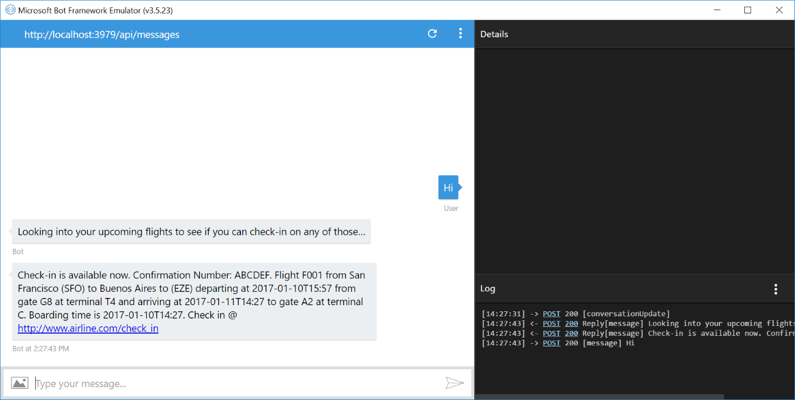

# ChannelData Bot Sample

A sample bot sending native metadata to Facebook using ChannelData.

[![Deploy to Azure][Deploy Button]][Deploy ChannelData/Node]
[Deploy Button]: https://azuredeploy.net/deploybutton.png
[Deploy ChannelData/Node]: https://azuredeploy.net

### Prerequisites

The minimum prerequisites to run this sample are:
* Latest Node.js with NPM. Download it from [here](https://nodejs.org/en/download/).
* The Bot Framework Emulator. To install the Bot Framework Emulator, download it from [here](https://emulator.botframework.com/). Please refer to [this documentation article](https://github.com/microsoft/botframework-emulator/wiki/Getting-Started) to know more about the Bot Framework Emulator.
* **[Recommended]** Visual Studio Code for IntelliSense and debugging, download it from [here](https://code.visualstudio.com/) for free.
*  To fully test this sample you must:
    *  Register you bot in [Microsoft Bot Framework Portal](https://dev.botframework.com/bots). Please refer to [this](https://docs.botframework.com/en-us/csharp/builder/sdkreference/gettingstarted.html#registering) for the instructions. Once you complete the registration, update the [Bot's .env file](.env) file with the registered config values (MICROSOFT_APP_ID and MICROSOFT_APP_PASSWORD). 
    *  Enable the Facebook Messenger Channel. Refer to [this](https://docs.botframework.com/en-us/csharp/builder/sdkreference/gettingstarted.html#channels) for more information on how to configure channels.
    *  [Publish your bot, for example to Azure](https://docs.botframework.com/en-us/csharp/builder/sdkreference/gettingstarted.html#publishing) or use [Ngrok to interact with your local bot in the cloud](https://blogs.msdn.microsoft.com/jamiedalton/2016/07/29/ms-bot-framework-ngrok/).

### Code Highlights

Many messaging channels provide the ability to attach richer objects. Bot Builder lets you express these attachments in a cross channel way and [connectors](https://docs.botframework.com/en-us/node/builder/chat-reference/interfaces/_botbuilder_d_.iconnector.html) will do their best to render the attachments using the channels native constructs.

If you want to be able to take advantage of special features or concepts for a channel we provide a way for you to send native metadata to that channel giving you much deeper control over how your bot interacts on a channel. The way you do this is to pass extra properties via the [Message.sourceEvent](https://docs.botframework.com/en-us/node/builder/chat-reference/classes/_botbuilder_d_.message.html#sourceevent) method.

> NOTE: You do not need to use this feature unless you feel the need to access functionality not provided by the normal Activity.

The Facebook adapter supports sending full attachments via the [sourceEvent](https://docs.botframework.com/en-us/node/builder/chat-reference/classes/_botbuilder_d_.message.html#sourceevent) method. This allows you to do anything natively that Facebook supports via the attachment schema, such as Send a check-in reminder message.
Check out [app.js](app.js#L28-L54) where a new [`AirlineCheckin`](facebook-channeldata.js#L4-L24) instance is send to the Facebook API using the channel's native construct.

````JavaScript
var checkin = new FacebookDataModels.AirlineCheckin(
    'Check-in is available now',
    'en_US',
    'ABCDED',
    'http://www.airline.com/check_in',
    [
        new FacebookDataModels.FlightInfo(
            'F001',
            new FacebookDataModels.Airport(
                'SFO',
                'San Francisco',
                'T4',
                'G8'
            ),
            new FacebookDataModels.Airport(
                'EZE',
                'Buenos Aires',
                'C',
                'A2'
            ),
            new FacebookDataModels.FlightSchedule(
                now.addDays(1),
                now.addDays(1).addHours(1.5),
                now.addDays(2)
            ))
    ]);
````

Alternativly, you can provide JSON object instead of using the AirlineCheckin object.

````JavaScript
var checkin = {
    "type": "template",
    "payload": {
        "template_type": "airline_checkin",
        "intro_message": "Check-in is available now",
        "locale": "en_US",
        "pnr_number": "ABCDED",
        "checkin_url": "http://www.airline.com/check_in",
        "flight_info": [
            {
                "flight_number": "F001",
                "departure_airport": {
                    "airport_code": "SFO",
                    "city": "San Francisco",
                    "terminal": "T4",
                    "gate": "G8"
                },
                "arrival_airport": {
                    "airport_code": "EZE",
                    "city": "Buenos Aires",
                    "terminal": "C",
                    "gate": "A2"
                },
                "flight_schedule": {
                    "boarding_time": formatDate(now.addDays(1)),
                    "departure_time": formatDate(now.addDays(1).addHours(1.5)),
                    "arrival_time": formatDate(now.addDays(2))
                }
            }
        ]
    }
};
````

Because `sourceEvent` accepts any object, it will hold any custom model we pass to it. In this sample, all [Models](facebook-channeldata.js) classes were built to match "attachment" JSON Schema described in the [Facebook's Send API Reference](https://developers.facebook.com/docs/messenger-platform/send-api-reference).
Additionally, the sample includes a little logic to render the attachment appropriately for different channels.

````JavaScript
var reply = new builder.Message(session);
if (session.message.address.channelId === 'facebook') {
    reply.sourceEvent({
        facebook: {
            attachment: checkin
        }
    });
} else {
    reply.text(checkin.toString());
}

session.send(reply);
````
### Outcome

You will see the following in the Bot Framework Emulator when opening and running the sample solution.



On the other hand, you will see the following in your Facebook Messenger.


### More Information

To get more information about how to get started in Bot Builder for Node and Attachments please review the following resources:
* [Bot Builder for Node.js Reference](https://docs.botframework.com/en-us/node/builder/overview/#navtitle)
* [Adding Channel Data](https://docs.botframework.com/en-us/core-concepts/channeldata)
* [Custom Channel Capabilities](https://docs.botframework.com/en-us/csharp/builder/sdkreference/channels.html)
* [Message.sourceEvent method](https://docs.botframework.com/en-us/node/builder/chat-reference/classes/_botbuilder_d_.message.html#sourceeventl)
* [Custom Facebook Messages](https://docs.botframework.com/en-us/csharp/builder/sdkreference/channels.html#customfacebookmessages)
* [Facebook Messenger - Send API Reference](https://developers.facebook.com/docs/messenger-platform/send-api-reference/airline-checkin-template)
