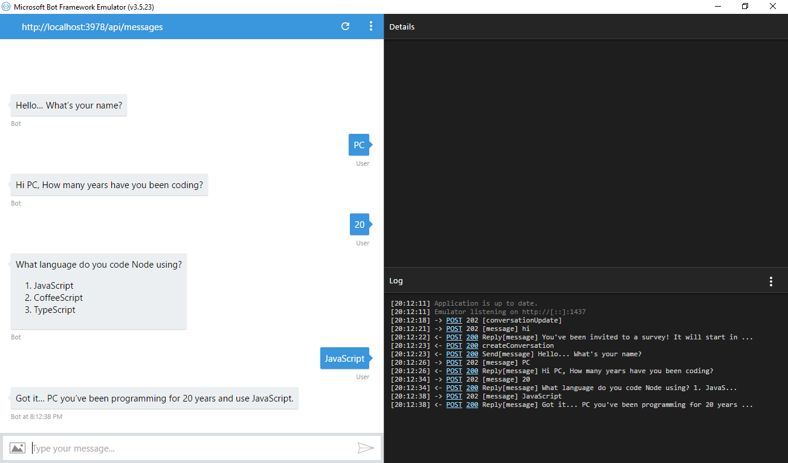

# Create New Conversation Bot Sample

A sample bot that starts a new conversation using a previously stored user address.

[![Deploy to Azure][Deploy Button]][Deploy CreateNewConversation/Node]
[Deploy Button]: https://azuredeploy.net/deploybutton.png
[Deploy CreateNewConversation/Node]: https://azuredeploy.net

### Prerequisites

The minimum prerequisites to run this sample are:
* Latest Node.js with NPM. Download it from [here](https://nodejs.org/en/download/).
* The Bot Framework Emulator. To install the Bot Framework Emulator, download it from [here](https://emulator.botframework.com/). Please refer to [this documentation article](https://github.com/microsoft/botframework-emulator/wiki/Getting-Started) to know more about the Bot Framework Emulator.
* **[Recommended]** Visual Studio Code for IntelliSense and debugging, download it from [here](https://code.visualstudio.com/) for free.

### Code Highlights

Bot Builder uses dialogs to model a conversational process, the exchange of messages, between bot and user. [bot.beginDialog()](app.js#L32) can be used to proactively start a new dialog to interact with the user.
Because, an address is required to initiate a new conversation, this user address should be saved during any previous conversation with the user. 
Any current conversation between the bot and user will be replaced with a new dialog stack.
Alternatively, [bot.send()](https://docs.botframework.com/en-us/node/builder/chat-reference/classes/_botbuilder_d_.universalbot.html#send) can be used to send a message without starting a dialog. 

````JavaScript
// this is the object we should persist if we want to create a new conversation anytime later
// copy it without the conversationId 
var address = session.message.address;
delete address.conversation;

// then... on another scope

// start survey dialog using stored address
bot.beginDialog(address, '/survey');
````

### Outcome

You will see the following when connecting the Bot to the Emulator and send it a message.



On the other hand, you will see the following in Skype.


### More Information

To get more information about how to get started in Bot Builder for Node and Dialogs please review the following resources:
* [Bot Builder for Node.js Reference](https://docs.botframework.com/en-us/node/builder/overview/#navtitle)
* [Proactive Messaging](https://docs.botframework.com/en-us/node/builder/chat/UniversalBot/#proactive-messaging)
* [Starting a Conversation](https://docs.botframework.com/en-us/core-concepts/conversation/)
* [Dialogs](https://docs.botframework.com/en-us/node/builder/chat/dialogs/)
* [UniversalBot.beginDialog](https://docs.botframework.com/en-us/node/builder/chat-reference/classes/_botbuilder_d_.universalbot.html#begindialog)
* [UniversalBot.send](https://docs.botframework.com/en-us/node/builder/chat-reference/classes/_botbuilder_d_.universalbot.html#send) & [IMessage interface](https://docs.botframework.com/en-us/node/builder/chat-reference/interfaces/_botbuilder_d_.imessage.html)

> **Limitations**  
> The functionality provided by the Bot Framework Activity can be used across many channels. Moreover, some special channel features can be unleashed using the [Message.sourceEvent](https://docs.botframework.com/en-us/node/builder/chat-reference/classes/_botbuilder_d_.message.html#sourceevent) method.
> 
> The Bot Framework does its best to support the reuse of your Bot in as many channels as you want. However, due to the very nature of some of these channels, some features are not fully portable.
> 
> The features used in this sample are fully supported in the following channels:
> - Skype
> - SMS
> - Slack
> - Email
> 
> They are also supported, with some limitations, in the following channel:
> - Telegram
> 
> On the other hand, they are not supported and the sample won't work as expected in the following channels:
> - Facebook
> - DirectLine
> - WebChat
> - Kik
> - GroupMe
