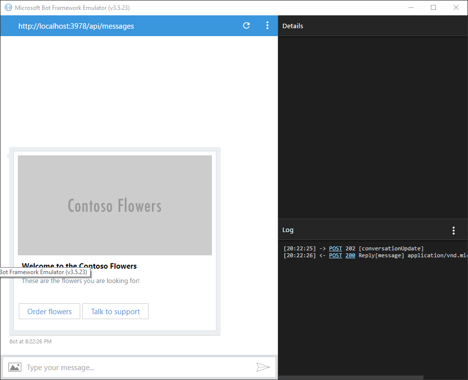
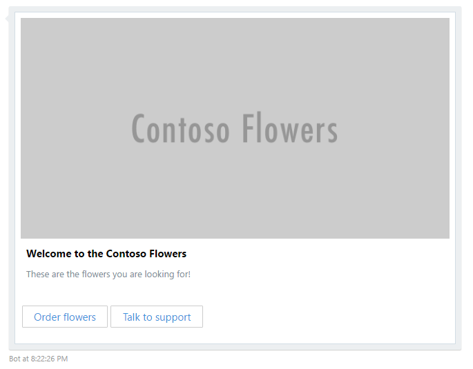
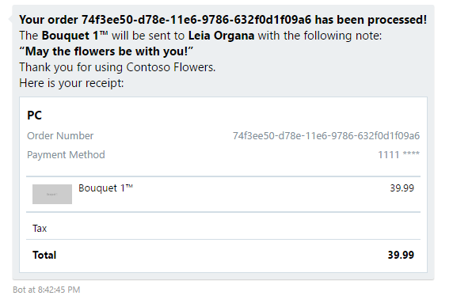
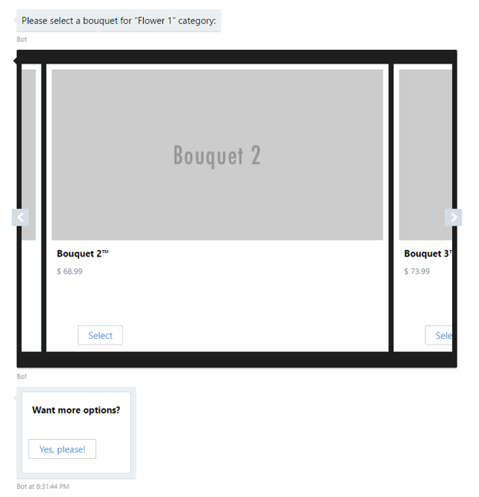
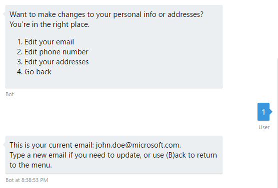
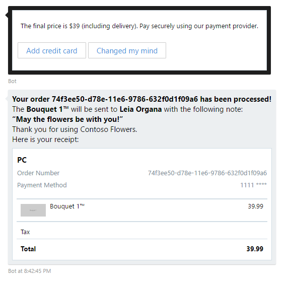

# Contoso Flowers Sample Bot

Your company started looking for a new platform to create new chat bots and port existing bots and is searching which better suits their needs. One of the requirements is that you'll need to support different platforms (Facebook, Slack, Skype and Webchat).
Several chat bots already exists in these platforms using different tools and learned that different platforms support different native features. Moreover, there's a running implementation of the bot in the native platform (e.g. a Facebook bot) which makes you want to make sure using native features is supported.

You came across the Microsoft Bot Framework which support a great variety of channels (platforms), programming languages (C# and Node) and supports both state-of-the-art standard bot features and mechanisms to also take advantage of native features (via ChannelData).

[![Deploy to Azure][Deploy Button]][Deploy ContosoFlowers/Node]
[Deploy Button]: https://azuredeploy.net/deploybutton.png
[Deploy ContosoFlowers/Node]: https://azuredeploy.net

### Prerequisites

The minimum prerequisites to run this sample are:
* Latest Node.js with NPM. Download it from [here](https://nodejs.org/en/download/).
* The Bot Framework Emulator. To install the Bot Framework Emulator, download it from [here](https://emulator.botframework.com/). Please refer to [this documentation article](https://github.com/microsoft/botframework-emulator/wiki/Getting-Started) to know more about the Bot Framework Emulator.
* **[Recommended]** Visual Studio Code for IntelliSense and debugging, download it from [here](https://code.visualstudio.com/) for free.

#### Integration with Express.js
BotBuilder is implemented as a REST API, basically a web endpoint where all your bot messages will be routed to. This is done through the ChatConnector's [listen()](https://docs.botframework.com/en-us/node/builder/chat-reference/classes/_botbuilder_d_.chatconnector.html#listen) function and it is hooked to your existing [express.js](https://expressjs.com/) or [restify.js](http://restify.com/) application, thus leveraging your web application scalability. If the scaling requirements of your bot are different than your web application, you can opt to host it separatly.

The simplest way to hook your bot with your express.js app is to use express.js routing as follows: 
````JavaScript
server.post('/api/messages', connector.listen());
````

In Contoso Flowers, we are wrapping the Connector's `listen()` method in order to capture the web application's url. We'll use this url later to create a link to the ckeckout form.

Checkout [bot/index.js](bot/index.js#L108-L118) to see how to capture the url and [app.js](app.js#L23-L25) to see how to register the hook.

````JavaScript
// /bot/index.js
var connectorListener = connector.listen();
function listen() {
    return function (req, res) {
        // Capture the url for the hosted application
        // We'll later need this url to create the checkout link 
        var url = req.protocol + '://' + req.get('host');
        siteUrl.save(url);
        connectorListener(req, res);
    };
}

module.exports.listen = listen;

// /app.js
// Then, register the hook from your express.js application:
var bot = require('./bot');
app.post('/api/messages', bot.listen());
```` 

#### Welcome Message

Some platforms provide a way to detect when a new conversation with the bot is created. We can use this to provide a welcome message  before the user starts typing. This can be achived using the [`conversationUpdate`](https://docs.botframework.com/en-us/node/builder/chat-reference/interfaces/_botbuilder_d_.iconversationupdate.html) event. Checkout [bot/index.js](bot/index.js#L82-L91) for details on how the root dialog is triggered.

````JavaScript
// Send welcome when conversation with bot is started, by initiating the root dialog
bot.on('conversationUpdate', (message) => {
    if (message.membersAdded) {
        message.membersAdded.forEach((identity) => {
            if (identity.id === message.address.bot.id) {
                bot.beginDialog(message.address, '/');
            }
        });
    }
});
````



#### Multi-Dialogs Approach

Dialogs can be composed with other dialogs to maximize reuse, and a dialog context maintains a stack of dialogs active in the conversation. In this sample, the main flow is implemented in the [shop dialog](bot/dialogs/shop.js) and it is composed of several other dialogs that may also break-down into sub-dialogs.

Each of these dialogs are implemented as a [BotBuilder Library](https://docs.botframework.com/en-us/node/builder/chat-reference/classes/_botbuilder_d_.library.html) (more information below). The important thing is that each library manages a small step in the flow, and the result of each is passed back to the dialog stack using [session.endDialogWithResult()](https://docs.botframework.com/en-us/node/builder/chat-reference/classes/_botbuilder_d_.session.html#enddialogwithresult).

These are the more important ones related to the shopping experience:

* [**Shop Dialog**](bot/dialogs/shop.js)
  
  Handles the main flow of the shopping experience. Calls other dialogs to capture information like the selected product, delivery address, recipient information and triggers the checkout flow.

* [**Address Dialogs**](bot/dialogs/address.js)

  Asks for address using [BotBuilder's Location picker control](https://github.com/Microsoft/BotBuilder-Location). It also contains the dialog for asking and saving the billing addresses.

* [**Details Dialogs**](bot/dialogs/details.js)

  Asks for recipient name, notes and sender information.

* [**Product Selection Dialog**](bot/dialogs/product-selection.js)

  Displays categories and their products. Handles pagination of products and validating the product selection.

* [**Checkout Dialog**](bot/dialogs/checkout.js)

  Displays a summary of the order and provides a link to the web application for payment. Also handles sending the receipt to the user once the purchase is completed.

* [**Settings Dialog**](bot/dialogs/settings.js)

  Handles viewing and editing the user's saved information, like phone number, email and billing addresses.

#### Bot Libraries for Creating Reusable Dialogs

Libraries of reusable parts can be developed by creating a new Library instance and adding dialogs just as you would to a bot. Your library should have a unique name that corresponds to either your libraries website or NPM module name. Bots can then reuse your library by simply adding your parts Library instance to their bot using [UniversalBot.library()](https://docs.botframework.com/en-us/node/builder/chat-reference/classes/_botbuilder_d_.universalbot.html#library).

To invoke dialogs within the bot, we use [session.beginDialog()](https://docs.botframework.com/en-us/node/builder/chat-reference/classes/_botbuilder_d_.session.html#begindialog) with a fully qualified dialog id in the form of ':'.

E.g.: To start the shopping's experience root dialog we use `session.beginDialog('shop:/')`.

````JavaScript
// /bot/dialogs/shop.js
const lib = new builder.Library('shop');
lib.dialog('/', [
    function (session) {
        // Ask for delivery address using 'address' library
        session.beginDialog('address:/',
            {
                promptMessage: session.gettext('provide_delivery_address', session.message.user.name || session.gettext('default_user_name'))
            });
    },
    function (session, args) {
        // Retrieve address, continue to shop
        session.dialogData.recipientAddress = args.address;
        session.beginDialog('product-selection:/');
    },
    // ...
});
````

Another more common approach for this feature is encapsulating a re-usable dialog. A good example of these are prompt validators. In this sample, common validations are packaged in the [bot/validators](bot/validators.js) library.

This is how you could package an email validation:

````JavaScript
const EmailRegex = new RegExp(/[a-z0-9!#$%&'*+\/=?^_`{|}~-]+(?:\.[a-z0-9!#$%&'*+\/=?^_`{|}~-]+)*@(?:[a-z0-9](?:[a-z0-9-]*[a-z0-9])?\.)+[a-z0-9](?:[a-z0-9-]*[a-z0-9])?/);

const library = new builder.Library('validators');

library.dialog('email',
    builder.DialogAction.validatedPrompt(builder.PromptType.text, (response) =>
        EmailRegex.test(response)));

module.exports = library;
```` 

And this is how you can call the validator from your existing code:

````JavaScript
// Waterfall Dialog
[
    function (session) {
        session.beginDialog('validators:email', {
            prompt: 'What\'s your email?',
            retryPrompt: 'Something is wrong with that email address. Please try again.'
        });
    },
    function (session, args, next) {
        var email  = args.response;
        // TODO: Save email address
        // ...
    }
]
````

> It is worth noting that calling other dialogs within your library don't need to be prefixed with the library's id. It is only when crossing from one library context to another that you need to include the library name prefix on your `session.beginDialog()` calls.

Another example of a reusable library is the [BotBuilder's Location picker control](https://github.com/Microsoft/BotBuilder-Location). Once the module is added to your project dependencies, you can register it with your bot and start using it.
Checkout the [address dialog](bot/dialogs/address.js#L6-L29) to see its usage within Contoso Flowers.

````JavaScript
const lib = new builder.Library('address');

// Register BotBuilder-Location dialog
lib.library(locationDialog.createLibrary(process.env.BING_MAPS_KEY));

// Main request address dialog, invokes BotBuilder-Location
lib.dialog('/', [
    function (session, args) {
        // Use botbuilder-location dialog for address request
        var options = {
            prompt: 'What is your address?',
            useNativeControl: true,
            reverseGeocode: true,
            requiredFields:
                locationDialog.LocationRequiredFields.streetAddress |
                locationDialog.LocationRequiredFields.locality |
                locationDialog.LocationRequiredFields.country
        };

        locationDialog.getLocation(session, options);
    },
    // ...
````

#### Rich Cards 

Many messaging channels provide the ability to attach richer objects. The Bot Framework has the ability to render rich cards as attachments.

The bot will render a Welcome message upon the first message or conversation start using a [HeroCard](https://docs.botframework.com/en-us/node/builder/chat-reference/classes/_botbuilder_d_.herocard) attachment within the [bot's root dialog](bot/index.js#L22-L36).

````JavaScript
var welcomeCard = new builder.HeroCard(session)
    .title('welcome_title')
    .subtitle('welcome_subtitle')
    .images([
        new builder.CardImage(session)
            .url('https://placeholdit.imgix.net/~text?txtsize=56&txt=Contoso%20Flowers&w=640&h=330')
            .alt('contoso_flowers')
    ])
    .buttons([
        builder.CardAction.imBack(session, session.gettext(MainOptions.Shop), MainOptions.Shop),
        builder.CardAction.imBack(session, session.gettext(MainOptions.Support), MainOptions.Support)
    ]);

session.send(new builder.Message(session)
    .addAttachment(welcomeCard));
````

| Emulator | Facebook | Skype |
|----------|-------|----------|
||||


Another example of rich card, is the ReceiptCard which renders differently depending on the messaging channel being supported. The receipt card is created in the [checkout's `completed` dialog](bot/dialogs/checkout.js#L73-L107) and is sent once the user completed the order payment.

````JavaScript
// Retrieve order and create ReceiptCard
orderService.retrieveOrder(orderId).then((order) => {
    if (!order) {
        throw new Error(session.gettext('order_not_found'));
    }

    var messageText = session.gettext(
        'order_details',
        order.id,
        order.selection.name,
        order.details.recipient.firstName,
        order.details.recipient.lastName,
        order.details.note);

    var receiptCard = new builder.ReceiptCard(session)
        .title(order.paymentDetails.creditcardHolder)
        .facts([
            builder.Fact.create(session, order.id, 'order_number'),
            builder.Fact.create(session, offuscateNumber(order.paymentDetails.creditcardNumber), 'payment_method')
        ])
        .items([
            builder.ReceiptItem.create(session, order.selection.price, order.selection.name)
                .image(builder.CardImage.create(session, order.selection.imageUrl))
        ])
        .total(order.selection.price)
        .buttons([
            builder.CardAction.openUrl(session, 'https://dev.botframework.com/', 'more_information')
        ]);

    var message = new builder.Message(session)
        .text(messageText)
        .addAttachment(receiptCard);

    session.endDialog(message);
});
````

| Emulator | Facebook | Skype |
|----------|-------|----------|
||||

> You can also see a full sample explaining the different types of rich cards in the [Rich Cards Bot Sample](../cards-RichCards).

#### Carousel of Cards

You can send multiple rich card attachments in a single message. On most channels they will be sent as a list of rich cards, but some channels (like Skype and Facebook) can render them as a carousel of rich cards.

Listing categories and product accompanied with a descriptive image is an example of how a Carousel of Cards can be used.

The [product-selection](bot/dialogs/product-selection.js#L27) dialog uses the [CarouselPagination](bot/dialogs/CarouselPagination.js) helper to create a dialog closure that displays a carousel of very rich cards.

This helper provides an easy way to display results to the user, handle pagination of results and validates user selection. Example usage:

````JavaScript
var Products = require('../services/products');
var CarouselPagination = require('./dialogs/CarouselPagination');
var DefaultCategory = 'Flower 2';

bot.dialog('/', [
    function (session, args, next) {
        // Create dialog function 
        var displayProducts = CarouselPagination.create(
            // getPageFunc(pageNumber: number, pageSize: number):Promise<PagingResult>
            (pageNumber, pageSize) => Products.getProducts(DefaultCategory, pageNumber, pageSize),
            // getItemFunc(title: string):Promise<object>
            Products.getProduct,
            // itemToCardFunc(product: object):object
            (product) => ({
                title: product.name,
                subtitle: '$ ' + product.price.toFixed(2),
                imageUrl: product.imageUrl,
                buttonLabel: 'Choose'
            }),
            // settings
            {
                showMoreTitle: 'More items?',
                showMoreValue: 'Show me',
                selectTemplate: 'Select: ',
                pageSize: 5,
                unknownOption: 'I couldn\'t understand your selection. Please try again.'
            });

        // Invoke dialog function 
        // It  will handle product selection, pagination call or product list display 
        displayProducts(session, args, next);

    },
    function (session, args) {
        // Read selection
        var selectedProduct = args.selected;
        if (selectedProduct) {
            session.send('You selected "%s"', selectedProduct.name);
        }
    }
]);
````

| Emulator | Facebook | Skype |
|----------|-------|----------|
||||

> You can also see a full sample bot sending multiple rich card attachments in a single message using the Carousel layout in the [Carousel of Cards Bot Sample](../cards-CarouselCards).

#### Complex Forms

Handling a guided conversation like ordering a bouquet of flowers for your loved one can require a lot of effort. In order to simplify building guided conversations, the Bot Framework provides [Waterfall dialogs](https://docs.botframework.com/en-us/node/builder/chat/dialogs/#waterfall) that let you collect input from a user using a sequence of steps. A bot is always in a state of providing a user with information or asking a question and then waiting for input. In the Node version of Bot Builder its waterfalls that drive this back and forth flow.

Paired with the built-in Prompts you can easily prompt the user with a series of questions:

````JavaScript
library.dialog('/', [
    function (session) {
        builder.Prompts.text(session, 'What\'s the recipient\'s first name?');
    },
    function (session, args) {
        session.dialogData.recipientFirstName = args.response;
        builder.Prompts.text(session, 'What\'s the recipient\'s last name?');
    },
    function (session, args) {
        session.dialogData.recipientLastName = args.response;
        session.beginDialog('validators:phonenumber', {
            prompt: 'What\'s the recipient\'s phone number?',
            retryPrompt: 'Oops, that doesn\'t look like a valid number. Try again.',
            maxRetries: Number.MAX_VALUE
        });
    },
    function (session, args) {
        session.dialogData.recipientPhoneNumber = args.response;
        session.beginDialog('validators:notes', {
            prompt: 'What do you want the note to say? (in 200 characters)',
            retryPrompt: 'Oops, the note is max 200 characters. Try again.',
            maxRetries: Number.MAX_VALUE
        });
    },
    function (session, args) {
        session.dialogData.note = args.response;
        // ...
    }
]);
````

| Emulator | Facebook | Skype |
|----------|-------|----------|
||||

Bots based on Bot Builder implement something we call *Guided Dialog* meaning that the bot is generally driving (or guiding) the conversation with the user. With waterfalls you drive the conversation by taking an action that moves the waterfall from one step to the next. Calling a built-in prompt like Prompts.text() moves the conversation along because the users response to the prompt is passed to the input of the next waterfall step.

In the previous code sample we're using [session.dialogData](https://docs.botframework.com/en-us/node/builder/chat-reference/classes/_botbuilder_d_.session#dialogdata) to temporarily hold the details information. We do this because when our bot is distributed across multiple compute nodes, every step of the waterfall could be processed by a different compute node. The `dialogData` field ensures that the dialog's state is properly maintained between each turn of the conversation. You can store anything you want into this field but should limit yourself to JavaScript primitives that can be properly serialized.

#### State

Bots built using Bot Builder are designed to be stateless so that they can easily be scaled to run across multiple compute nodes. Because of that you should generally avoid the temptation to save state using a global variable or within a function closure. Doing so will create issues when you want to scale out your bot. Instead leverage the data bags below to persist temporary and permanent state.

Field | Use Cases
-------- | ---------
userData | Stores information globally for the user across all conversations.
conversationData | Stores information globally for a single conversation. This data is visible to everyone within the conversation so care should be used to what's stored there. It's disabled by default and needs to be enabled using the bots [`persistConversationData`](https://docs.botframework.com/en-us/node/builder/chat-reference/interfaces/_botbuilder_d_.iuniversalbotsettings.html#persistconversationdata) setting.
privateConversationData | Stores information globally for a single conversation but its private data for the current user. This data spans all dialogs so it's useful for storing temporary state that you want cleaned up when the conversation ends.
dialogData | Persists information for a single dialog instance. This is essential for storing temporary information in between the steps of a waterfall.

> If you are planning to use `conversationData`, remember to enable conversation data persistence by using the [`persistConversationData`](https://docs.botframework.com/en-us/node/builder/chat-reference/interfaces/_botbuilder_d_.iuniversalbotsettings.html#persistconversationdata) setting flag.

In this sample, the `userData` is used to store and retrieve several user settings, and `dialogData` for saving information between steps of a waterfall dialog.

The [settings dialog](bot/dialogs/settings.js) is used to manage the `userData`.

````JavaScript
switch (option) {
    case SettingChoice.Email:
        var promptMessage = 'Type your email or use (B)ack to return to the menu.';
        if (session.userData.sender && session.userData.sender.email) {
            promptMessage = 'This is your current email: ' + session.userData.sender.email + '.\n\nType a new email if you need to update, or use (B)ack to return to the menu.';
        }
        session.send(promptMessage);
        return session.beginDialog('email');

    case SettingChoice.Phone:
        var promptMessage = 'Type your phone number or use (B)ack to return to the menu.';
        if (session.userData.sender && session.userData.sender.phoneNumber) {
            promptMessage = 'This is your current phone number: ' + session.userData.sender.phoneNumber + '.\n\nType a new number if you need to update, or use (B)ack to return to the menu.';
        }
        session.send(promptMessage);
        return session.beginDialog('phone');
    // ...
}
````
| Emulator | Facebook | Skype |
|----------|-------|----------|
||||

> You can also see a full sample bot tracking context of a conversation in the [State API Bot Sample](../core-State).

The [shop dialog](bot/dialogs/shop.js) on the other hand, shows how to use `dialogData` to store information about the order and details, within the dialog instance, and then use it in the last step to trigger the checkout process.

````JavaScript
library.dialog('/', [
    function (session) {
        // Ask for delivery address using 'address' library
        session.beginDialog('address:/');
    },
    function (session, args) {
        // Retrieve address, continue to shop
        session.dialogData.recipientAddress = args.address;
        session.beginDialog('product-selection:/');
    },
    function (session, args) {
        // Retrieve selection, continue to delivery date
        session.dialogData.selection = args.selection;
        session.beginDialog('delivery:date');
    },
    //...
    function (session, args) {
        // Continue to checkout
        var order = {
            selection: session.dialogData.selection,
            delivery: {
                date: session.dialogData.deliveryDate,
                address: session.dialogData.recipientAddress
            },
            details: session.dialogData.details,
            billingAddress: session.dialogData.billingAddress
        };

        console.log('order', order);
        session.beginDialog('checkout:/', { order: order });
    }
]);
````


#### Globally Available Commands

Additionally, you'll notice the Settings dialog is globally available, meaning that the user can type `settings` anytime and the settings dialog will be taken on top of the conversation's dialog stack. A piece of [middleware](https://docs.botframework.com/en-us/node/builder/chat-reference/interfaces/_botbuilder_d_.imiddlewaremap.html) inspects every incoming message to see if it contains a specified word and gives the opportunity to manipulate the conversation stack, interrupting the normal dialog flow. Checkout the [middleware](bot/index.js#L61-L80) used to do this.

````JavaScript
// Trigger secondary dialogs when 'settings' or 'support' is called
const settingsRegex = /^settings/i;
const supportRegex = new RegExp('^(talk to support|help)', 'i');
bot.use({
    botbuilder: (session, next) => {
        var text = session.message.text;
        if (settingsRegex.test(text)) {
            // interrupt and trigger 'settings' dialog 
            return session.beginDialog('settings:/');
        } else if (supportRegex.test(text)) {
            // interrupt and trigger 'help' dialog
            return session.beginDialog('help:/');
        }   

        // continue normal flow
        next();
    }
});
````

| Emulator | Facebook | Skype |
|----------|-------|----------|
||||

#### External Events - Resuming Conversations

The exchange of messages between bot and user through a channel (e.g. Facebook Messenger, Skype, Slack) is the primary means of interaction. However, in some scenarios the bot is waiting for an event that occurs in an external component. For example, the passing of time, an external authentication provider (e.g. OAuth scenarios) or an external payment service. In such cases, an [Address](https://docs.botframework.com/en-us/node/builder/chat-reference/interfaces/_botbuilder_d_.iaddress.html) object has the information necessary to resume the conversation.

In this sample, the user proceeds to checkout the order by browsing to an url provided by the bot. This url includes an encoded version of the Address object generated in the [checkout's root dialog](bot/dialogs/checkout.js#L25) using the included [serializeAddress()](bot/utils.js#L28) helper function.

````JavaScript
// Serialize user address
var addressSerialized = botUtils.serializeAddress(session.message.address);

// Create order (with no payment - pending)
orderService.placePendingOrder(order).then((order) => {

    // Build Checkout url using previously stored Site url
    var checkoutUrl = util.format(
        '%s/checkout?orderId=%s&address=%s',
        siteUrl.retrieve(),
        encodeURIComponent(order.id),
        encodeURIComponent(addressSerialized));

    // ...
});
````

Once the user browses to the checkout page and process the payment, the `Address` included in the url is then decoded (using the [deserializeAddress](bot/utils.js#L29) function) and used to resume the conversation with the bot. You can check [express.js Checkout route](checkout.js) calling the [bot.beginDialog()](checkout.js#L64) function.

> These [helpers methods](bot/utils.js) serialize the address into JSON and then encrypts the string using AES256-CTR to avoid tampering. The inverse process occurs while deserializing the address.

````JavaScript
/* POST Checkout */
router.post('/', function (req, res, next) {
  // orderId and user address
  var orderId = req.body.orderId;
  var address = botUtils.deserializeAddress(req.body.address);

  // Payment information
  var paymentDetails = {
    creditcardNumber: req.body.creditcard,
    creditcardHolder: req.body.fullname
  };

  // Complete order
  orderService.confirmOrder(orderId, paymentDetails).then((processedOrder) => {

    // Dispatch completion dialog
    bot.beginDialog(address, 'checkout:completed', { orderId: orderId });

    // Show completion
    return res.render('checkout/completed', {
      title: 'Contoso Flowers - Order processed',
      order: processedOrder
    });
  });
});
````

| Emulator | Facebook | Skype |
|----------|-------|----------|
||||

#### More Advanced Features

While not covered in this sample, it is important to highlight two features that can help tailoring your bot the your specific needs.

If you want to be able to take advantage of special features or concepts for a channel we provide a way for you to send native metadata to that channel giving you much deeper control over how your bot interacts on a channel. The way you do this is to pass extra properties via the [sourceEvent method](https://docs.botframework.com/en-us/node/builder/chat-reference/classes/_botbuilder_d_.message.html#sourceevent).

> You can also see a full sample bot sending native metadata to Facebook using ChannelData in the [ChannelData Bot Sample](../core-ChannelData).

One of the key problems in human-computer interactions is the ability of the computer to understand what a person wants, and to find the pieces of information that are relevant to their intent. In the LUIS application, you will bundle together the intents and entities that are important to your task.

> You can also see a full sample bot using Luis(Dialog to integrate with a LUIS.ai application in the [LUIS Bot Sample](../intelligence-LUIS).

#### Localization

Bot Builder includes a [rich localization system](https://docs.botframework.com/en-us/node/builder/chat/localization/#navtitle) for building bots that can communicate with the user in multiple languages. All of your bots prompts can be localized using JSON files stored in your bots directory structure and if you're using a system like [LUIS](https://luis.ai/) to perform natural language processing you can configure your [LuisRecognizer](https://docs.botframework.com/en-us/node/builder/chat-reference/classes/_botbuilder_d_.luisrecognizer) with a separate model for each language your bot supports and the SDK will automatically select the model matching the users preferred locale.

The SDK provides a [session.preferredLocale()](https://docs.botframework.com/en-us/node/builder/chat-reference/classes/_botbuilder_d_.session#preferredlocale) method to both save and retrieve this preference on a per user basis. The SDK also provides a way to configure the default bot's locale:

````JavaScript
// Set default locale
bot.set('localizerSettings', {
    botLocalePath: './bot/locale',
    defaultLocale: 'en'
});
````

The default localization system for Bot Builder is file based and lets a bot support multiple languages using JSON files stored on disk. By default, the localization system will search for the bots prompts in the ./locale/[IETF TAG]/index.json file where [IETF TAG] is a valid [IETF language tag](https://en.wikipedia.org/wiki/IETF_language_tag) representing the preferred locale to use the prompts for. 

You can see in the previous code snippet that we are providing a locale path to inform the SDK where to look for language files. Each file in [this folder](bot/locale/en) corresponds to a another file in the [bot's dialogs folder](bot/dialogs). They contain the resource strings used by each dialog. E.g.:

````JavaScript
// bot/locale/en/index.js
{
    "welcome_title": "Welcome to the Contoso Flowers",
    "welcome_subtitle": "These are the flowers you are looking for!",
    "contoso_flowers": "Contoso Flowers",
    "main_options_order_flowers": "Order flowers",
    "main_options_talk_to_support": "Talk to support",
    "main_options_settings": "Settings",
    "help": "Help",
    "thank_you": "Support will contact you shortly. Have a nice day :)"
}
````

##### Leveraging the SDK to localize text automatically

Send text:

````JavaScript
bot.dialog("/", function (session) {
    session.send('welcome_title');              // Will print "Welcome to the Contoso Flowers"
    session.send('welcome_subtitle');           // Will print "These are the flowers you are looking for!"
}];
````

Send a card:

````JavaScript
var welcomeCard = new builder.HeroCard(session)
    .title('welcome_title')
    .subtitle('welcome_subtitle')
    .images([
        new builder.CardImage(session)
            .url('https://placeholdit.imgix.net/~text?txtsize=56&txt=Contoso%20Flowers&w=640&h=330')
            .alt('contoso_flowers')
    ]);

session.send(new builder.Message(session)
    .addAttachment(welcomeCard));
````

Internally, the SDK will call session.preferredLocale() to get the users preferred locale and will then use that in a call to session.localizer.gettext() to map the message ID to its localized text string. There are times where you may need to manually call the localizer.

##### Using the SDK to manually localize text

You can also localize content by using [session.gettext](https://docs.botframework.com/en-us/node/builder/chat-reference/classes/_botbuilder_d_.session.html#gettext) which returns a localized string using the session's preferred locale. This same method also supports template strings, where placeholders are replaced with the other arguments passed to the method. E.g:

````JavaScript
// bot/locale/en/checkout.json
{
    "final_price": "The final price is $%d (including delivery). Pay securely using our payment provider.",
}

// bot/dialogs/checout.js#L37
var messageText = session.gettext('final_price', order.selection.price);
var card = new builder.HeroCard(session)
    .text(messageText);
````

### More Information

To get more information about how to get started in Bot Builder for Node review the following resources:

* [Dialogs](https://docs.botframework.com/en-us/node/builder/chat/dialogs/)
* [Dialog Stack](https://docs.botframework.com/en-us/node/builder/chat/session/#dialog-stack)
* [Prompts](https://docs.botframework.com/en-us/node/builder/chat/prompts/)
* [Adding Dialogs and Memory](https://docs.botframework.com/en-us/node/builder/guides/core-concepts/#adding-dialogs-and-memory)
* [Collecting Input](https://docs.botframework.com/en-us/node/builder/guides/core-concepts/#collecting-input)
* [Attachments, Cards and Actions](https://docs.botframework.com/en-us/node/builder/chat-reference/interfaces/_botbuilder_d_.iattachment.html)
* [Bot Libraries](https://docs.botframework.com/en-us/node/builder/chat-reference/classes/_botbuilder_d_.library)
* [Localization](https://docs.botframework.com/en-us/node/builder/chat/localization/#navtitle)
* [Custom Channel Capabilities](https://docs.botframework.com/en-us/csharp/builder/sdkreference/channels.html)
* [LUIS](https://docs.botframework.com/en-us/node/builder/guides/understanding-natural-language/)


> **Limitations**  
> The functionality provided by the Bot Framework Activity can be used across many channels. Moreover, some special channel features can be unleashed using the [Message.sourceEvent](https://docs.botframework.com/en-us/node/builder/chat-reference/classes/_botbuilder_d_.message.html#sourceevent) method.
> 
> The Bot Framework does its best to support the reuse of your Bot in as many channels as you want. However, due to the very nature of some of these channels, some features are not fully portable.
> 
> The features used in this sample are fully supported in the following channels:
> - Skype
> - Facebook
> - Slack
> - DirectLine
> - WebChat
> - GroupMe
> 
> They are also supported, with some limitations, in the following channel:
> - Email
> 
> On the other hand, they are not supported and the sample won't work as expected in the following channels:
> - Telegram
> - SMS
> - Kik
