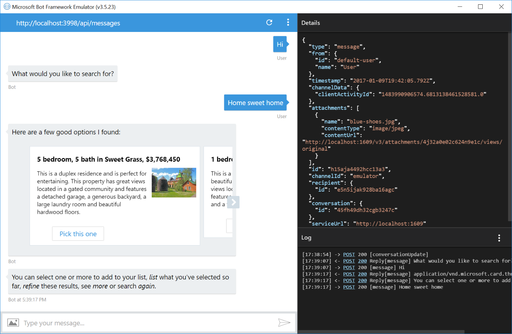
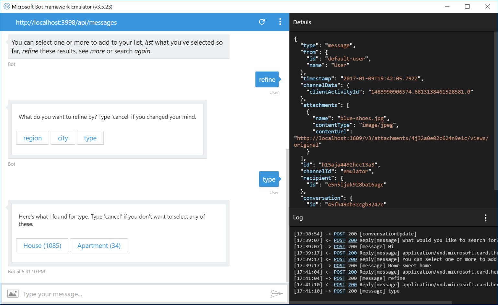
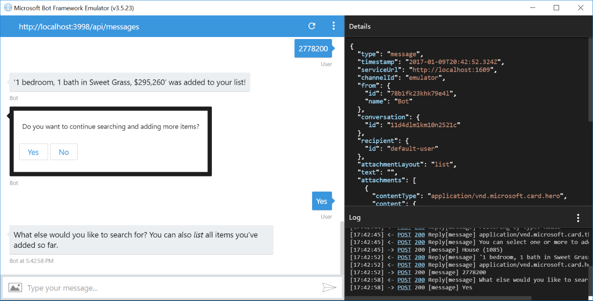
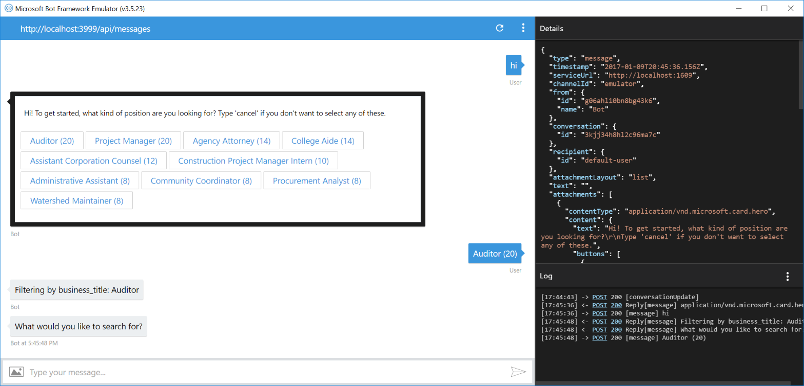

# Azure Search Samples

Depending on the nature of any given bot, sometimes you want to present structured dialogs that take users through tight paths, while in other cases you want to 
help users navigate a large amount of content. In many cases you'll have a mix of dialogs of both kinds in a single bot.  

These samples illustrate how to approach dialogs that need to help the user navigate large amounts of content, creating a data-driven exploration experience.

Content is modeled as a catalog of items where each item has several attributes that may be used for navigation, keyword search or display.

[![Deploy to Azure][Deploy Button]][Deploy Search/Node]
[Deploy Button]: https://azuredeploy.net/deploybutton.png
[Deploy Search/Node]: https://azuredeploy.net

### Prerequisites

The minimum prerequisites to run this sample are:
* Latest Node.js with NPM. Download it from [here](https://nodejs.org/en/download/).
* The Bot Framework Emulator. To install the Bot Framework Emulator, download it from [here](https://emulator.botframework.com/). Please refer to [this documentation article](https://github.com/microsoft/botframework-emulator/wiki/Getting-Started) to know more about the Bot Framework Emulator.
* **[Recommended]** Visual Studio Code for IntelliSense and debugging, download it from [here](https://code.visualstudio.com/) for free.

### Azure Search

The samples use [Azure Search](https://azure.microsoft.com/en-us/services/search/) as the backend for these dialogs. This is an Azure service that offers most of the needed pieces of functionality, including keyword search, built-in linguistics, custom scoring, faceted navigation and more. Azure Search can also index content from various sources (Azure SQL DB, DocumentDB, Blob Storage, Table Storage), supports "push" indexing for other sources of data, and can crack open PDFs, Office documents and other formats containing unstructured data. The content catalog goes into an Azure Search index, which we can then query from dialogs.

> As a good practice, all the Azure Search specific components are implemented in the [SearchProviders/azure-search](SearchProviders/azure-search.js) module. You can implement new providers be following the same API exposed by the module. See [Implementing a new Search Provider](#implementing-a-new-search-provider) below for more information.

### Library & Dialogs

The samples include a bot library that contains a few different dialogs that are ready to use and can be customized as needed. The library is defined as the [SearchDialogLibrary](SearchDialogLibrary/index.js) module and it includes two main dialogs that can be used directly:

* [Root dialog](SearchDialogLibrary/index.js#L35) offers a complete keyword search + refine experience over a search index, and uses the other search dialogs as building blocks. Users can explore the catalog by refining (using facets) and by using keyword search. They can also select items and review their selection. At the end of this dialog a list of one or more selected items is returned.

* [Refine dialog](SearchDialogLibrary/index.js#L151) helps users pick a refiner (facet). It's a simple wrapper around a "choice" prompt dialog to ensure you don't prompt users for a field you already refined on.

### Samples

We included two samples here:

1. [RealEstateBot](RealEstateBot/app.js) is a bot for exploring a real estate catalog.

  It starts by taking an arbitrary set of keywords.
  
  | Emulator | Facebook | Skype |
  |----------|-------|----------|
  ||||
  
  From there you can go back and forth between keyword search and refinement using region, city and type of property.
  
  | Emulator | Facebook | Skype |
  |----------|-------|----------|
  ||||

  You can pick one or more properties and at the end you'll get a list of your choices (a real bot would probably contact your agent with your elections, or send you a summary email for future reference).
  
  | Emulator | Facebook | Skype |
  |----------|-------|----------|
  ||||

2. [JobListingBot](JobListingBot/app.js) is a bot for browing a catalog of job offerings. 

  It starts by asking for a top-level refinement, a useful things to do in order to save users from an initial open-ended interation with the bot where they don't know what they can say.
  
  | Emulator | Facebook | Skype |
  |----------|-------|----------|
  ||||

> All samples target a shared, ready-to-use Azure Search service, so you don't need to provision your own to try these out.

### Usage

In order to use the library you need to create an instance of it using the module's `create()` function and specify parameters that provides the search implementation and some level of customization for the search experience. Then, you register the returned library object with [`bot.use()`](https://docs.botframework.com/en-us/node/builder/chat-reference/classes/_botbuilder_d_.universalbot.html#use) and trigger the dialogs with `SearchModule.begin(session)` or `SearchModule.refine(session, arguments)`.

````JavaScript
var SearchLibrary = require('./SearchDialogLibrary');
var mySearchLibrary = SearchLibrary.create({
    multipleSelection: true,
    search: (query) => { return mySearchClient.search(query).then(mapResultSetFunction); },
    refiners: ['type', 'region']
});

bot.use(mySearchLibrary);

// Root dialog, triggers search and process its results
bot.dialog('/', [
    function (session) {
        // Triger search dialog
        SearchLibrary.begin(session);
    },
    function (session, args) {
        // Display selected results
        session.send(
            'Done! You selected these items: %s',
            args.selection.map(i => i.title).join(', '));
    }
]);
````

#### Parameters and Settings

> SearchDialogLibrary.create(settings):Library

* `settings` is required. The only detail really needed is the `search` function.
    * `search` is a required function. Accepts a `query` object and must return a Promise with a [`ISearchResults`](SearchDialogLibrary/index.d.ts#L30-L33) object (See [Implementing a new Search Provider](#implementing-a-new-search-provider) below).
    * `multipleSelection` (optional - default=true). Boolean value indicating if multiple selection should be allowed. When `false`, the dialog will end as soon as an item is selected.
    * `pageSize` (optional - default=5). Page size parameter passed to the search function.
    * `refiners`. (optional). Array of strings containing the facets/refiners allowed to use.
    * `refineFormatter`. (optional). Mapping function that must return a tuple for the refiner labels (to displayed to the user) and values (to send to the search provider).

> You can also take a look at the [TypeScript Type Definitions](SearchDialogLibrary/index.d.ts) file.

#### Implementing a new Search Provider

This sample comes with an [Azure Search provider](SearchProviders/azure-search.js) ready to use. But there are cases were you'll want ot integrate another search engine or provider.

In order to integrate the Search Dialog library with a new search engine, you need to implement a function using the following signature:

````
function search: (query: Query) => PromiseLike<SearchResults>
````

Input [`query`](SearchDialogLibrary/index.d.ts#L22-L28) object with the following fields:

* `searchText`: string

  The search string the user wants to look for.

* `pageSize`: number

  Number of items to display in the results Carousel. If you are supporting Skype, the recommendation is 5 since it is Skype's limit for the Carousel component. 

* `pageNumber`: number

  The page number the use requested. You should use `pageNumber` and `pageSize` to calculate *offset* and *limit* values.

* `filters`: Array of FacetFilter.

   List of filters/facets to apply on the search. An array of key/value objects. E.g.: `[ { key: 'Region', value: 'US' }, { key: 'Type', value: 'House' } ]`

* `facets`: Array of string

  An array containing the facets you want to obtain possible values for. The search function should take this into account and proceed to *search* or *retrieve sub-categories* for the current search string.

The `search` must return a `Promise`, that once fulfilled, should resolve to a [`ISearchResults`](SearchDialogLibrary/index.d.ts#L30-L33) object. This object must have the following fields:

* `facets`: Array of `Facet`. Each Facet object contains a `key` field with the name of the facet and an `options` field with an array of possible values. Each value is a tuple of `key` representing a possible facet value, and a `count` field with the total items for that facet.

* `results`: Array of `SearchHit`. Each SearchHit is the object that will be displayed. The object may contain any number of fields, but these are required:

 * `key`: string. It is the Id of the object.

 * `title`: The name or title for the search result.

 * `description`: A description to be displayed about the item.

 * `imageUrl`: (optional) An url to be used along with the Hero Card when displaying the item.

> You can take a look at a [mocked search provider](SearchProviders/mock-search.js) for reference.

### More Information

To get more information about how to get started in Bot Builder for Node please review the following resources:
* [Bot Builder for Node.js Reference](https://docs.botframework.com/en-us/node/builder/overview/#navtitle)
* [Azure Search](https://azure.microsoft.com/en-us/services/search/)
* [Dialogs](https://docs.botframework.com/en-us/node/builder/chat/dialogs/)
* [Dialog Stack](https://docs.botframework.com/en-us/node/builder/chat/session/#dialog-stack)
* [BotBuilder Library](https://docs.botframework.com/en-us/node/builder/chat-reference/classes/_botbuilder_d_.library.html)

> **Limitations**  
> The functionality provided by the Bot Framework Activity can be used across many channels. Moreover, some special channel features can be unleashed using the [Message.sourceEvent](https://docs.botframework.com/en-us/node/builder/chat-reference/classes/_botbuilder_d_.message.html#sourceevent) method.
> 
> The Bot Framework does its best to support the reuse of your Bot in as many channels as you want. However, due to the very nature of some of these channels, some features are not fully portable.
> 
> The features used in these samples are fully supported in the following channels:
> - Skype
> - Facebook
> - Microsoft Teams
> - Telegram
> - DirectLine
> - WebChat
> - Slack
> - GroupMe
> 
> They are also supported, with some limitations, in the following channel:
> - Email
> 
> On the other hand, they are not supported and the sample won't work as expected in the following channels:
> - SMS
> - Kik
