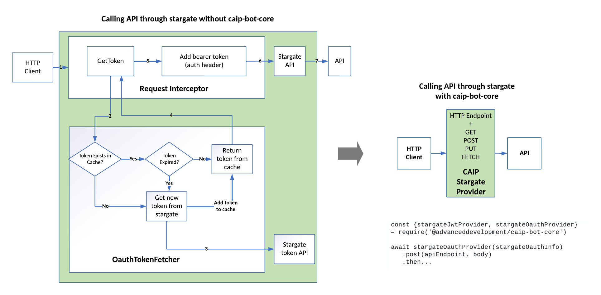

<p align="center"></p>

<h1 align="center">❯ CAIP BOT CORE</h1>
<p align="center"><strong>Powering CAIP BOT Framework of Conversational AI Platform</strong></p>

<p align="center">

<a href=".github/CONTRIBUTING.md">
    
</a>
<a href="https://www.flowdock.com/app/uhg/caip-team">
    
</a>
</p>

## Overview

CAIP BOT CORE is powering CAIP BOT Framework of CAIP Platform by providing following reusable modules:

- OAUTH PROVIDERS: StargateJwtProvider & StargateOauthProvider
- EMAIL MANAGER: Send email using asynchronous, resilient email capability
- SHARED UTILs: KeyVaultSecretFetcher etc.
- FDS PROVIDERS: fdsOauthProvider
- BOT AUTHENTICATOR ; CaipBotAuthenticator for generating Directline token
- BOT BUILDER: (roadmap)
- BOT DIALOGS: (roadmap)

## Getting Started

### Prerequisites

- [Node.js](http://nodejs.org)
- [Git](https://git-scm.com) and a [GitHub Enterprise account](https://github.optum.com/) (_request `github_users` from secure_)

### Installing @advanceddevelopment/caip-bot-core

#### _PER OPTUM REQUIREMENT_

> Npm registry must be set to Artifactory

See [this](https://github.optum.com/gist/wkurth/8a5c6539ddcaad4bd49a015d33b969c5) for more information!

Open a command line tool, like Terminal, and run the following commands:

Run :

```shell
npm config set registry https://repo1.uhc.com/artifactory/api/npm/npm-virtual/
```

Then run:

```shell
npm install @advanceddevelopment/caip-bot-core
```

## OAUTH Providers

### STARGATE Provider



#### Capabilities

- fetch the oauth token based on below stargate settings for client_credentials flow
- cache the oauth token to reuse until expiry
- reuse the token in http requests until expiry
- renew the token automatically
- intercept the http request and add bearer token in 'Authorization' header automatically
- retry attempts based on configuration
- supports both oauth2 and jwt stargate auth types

#### Getting Started

1. Import the stargate provider
   ```
   const {stargateJwtProvider, stargateOauthProvider} = require('@advanceddevelopment/caip-bot-core')
   ```
2. call you api endpoint

   ```
   await stargateJwtProvider({clientId: 'stargateClientId', clientSecret: 'stargateClientSecret'})
      .post(apiEndpoint, body)
      .then...

   await stargateOauthProvider({clientId: 'stargateClientId', clientSecret: 'stargateClientSecret', tokenUrl: 'stargateTokenUrl'})
      .post(apiEndpoint, body)
      .then...

   ```

> Stargate provider will intercept the request and add bearer token out of box along with caching of token to reuse

## Email Manager

1. Import the Email Manager in your bot
   ```
   const {EmailManager} = require('@advanceddevelopment/caip-bot-core')
   ```
2. send email

   ```
   await new EmailManager('serviceBusConnectionString, 'queuName')
      .sendEmail(emailMessage)
      .then...

   ```

## Shared Utils

### KeyVaultSecretFetcher

1. Import the KeyVaultSecretsFetcher
   ```
   const {KeyVaultSecretsFetcher} = require('@advanceddevelopment/caip-bot-core')
   ```
2. get secret for specific key

   ```
   await new KeyVaultSecretsFetcher('keyVaultUrl')
      .getSecretForKey(secretKey);

   ```

## FDS Provider

### Store Document to FDS

1. Import the FDS provider
   ```
   const {fdsOauthProvider} = require('@advanceddevelopment/caip-bot-core')
   ```
2. call you api endpoint

   ```
   await fdsOauthProvider({clientId: 'clientId', clientSecret: 'clientSecret', tokenUrl: "https://fds-token.com/oauth2/token"})
      .post(apiEndpoint, body)
      .then...

   sample of body object = {
      fileName: "filename.pdf",
      file: data, // data can be stream or buffer
      spaceId: "spaceId",  //fds space id
      expiryDate: "2021/07/31" // document expiration data in format "YYYY/MM/DD" and GMT
   }
   ```

### Retrieve Document to FDS

1. Import the FDS provider
   ```
   const {fdsOauthProvider} = require('@advanceddevelopment/caip-bot-core')
   ```
2. call you api endpoint

   ```
   await fdsOauthProvider({clientId: 'clientId', clientSecret: 'clientSecret', tokenUrl: "https://fds-token.com/oauth2/token"})
      .get(apiEndpoint, body)
      .then...

   sample body = {
      spaceId: "spaceId",  //fds space id
      documentId: "documentId",  // document id
      timeToLive: "604800" // time for the document to live in second
   }
   ```

### Bot Authenticator

1. Import the Caip Bot Authenticator package
   ```
   const { BotAuthenticatorUserInfo, CaipBotAuthenticator, ContinueConversationConfig } = require("@advanceddevelopment/caip-bot-core");
   ```
2. There are flavors of getToken function available. To simply get token
   ```
   await (new CaipBotAuthenticator("DIRECTLINE_SECRET")).getToken();
   ```
3. If there's userInfo to be embedded in the token or continueConversation Configuration you can create an object as follows. Refer to imported BotAuthenticatorUserInfo and ContinueConversationConfig for documentation.
   ```js
   const userInfo = {
     user: {
       id: "USER_ID",
       name: "USER_NAME",
     },
   };
   const continueConversationConfig = {
     storageAcccountConnectionString: "STORAGE_ACCOUNT_CONNECTION_STRING",
     userId: "USER_ID",
     daysToContinueConversation: 14,
     fallBackToNewConversation: true,
     clearExpiredConversation: false
   };
   ```

Pass the information as follows. Both fields are optional.

```js
await new CaipBotAuthenticator("DIRECTLINE_SECRET").getToken({
  BotAuthenticatorUserInfo: userInfo,
  ContinueConversationConfig: continueConversationConfig,
});
```

## Local Development

1. Clone the repo
   ```
   git clone https://github.optum.com/advanced-developement/caip-bot-core.git
   ```
2. Change to new `caip-bot-core` directory
3. Run `npm install`

### Tests

Unit tests are written with mocha/chai and are within the `./test` directory. Run `npm test` to run the unit tests locally.

### Deployment

To publish to Artifactory manually, run the following commands:

```
npm adduser --registry=https://repo1.uhc.com/artifactory/api/npm/npm-local/ --scope=@advanceddevelopment
```

(_must have write permission to `npm-local@advanceddevelopment`_)

```
npm publish --registry http://repo1.uhc.com/artifactory/api/npm/npm-local/@advanceddevelopment --scope=@advanceddevelopment --access public
```

## Contributing

Please read the [contribution guidelines](.github/CONTRIBUTING.md) for and learn how to contribute back to caip-bot-core!
