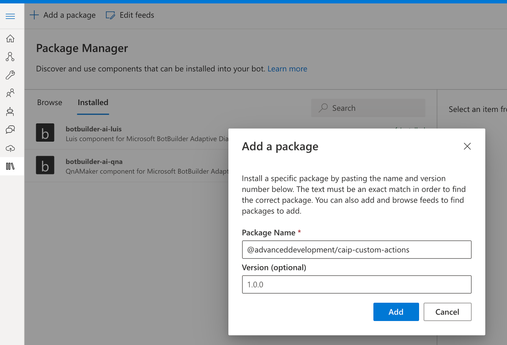
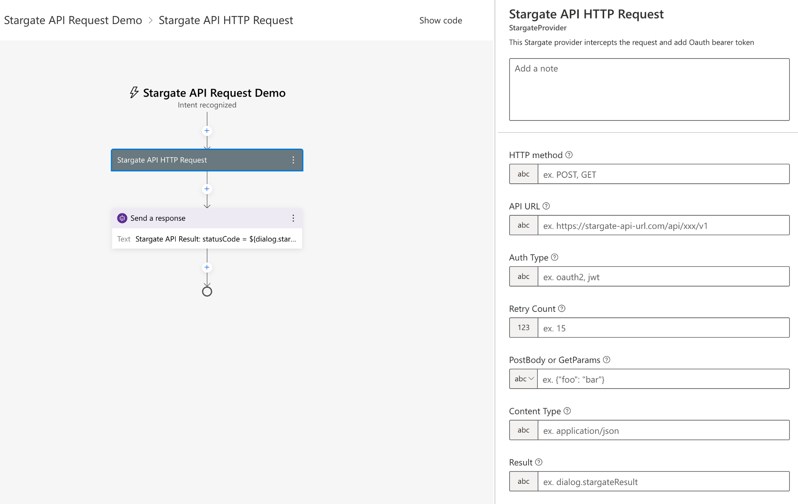
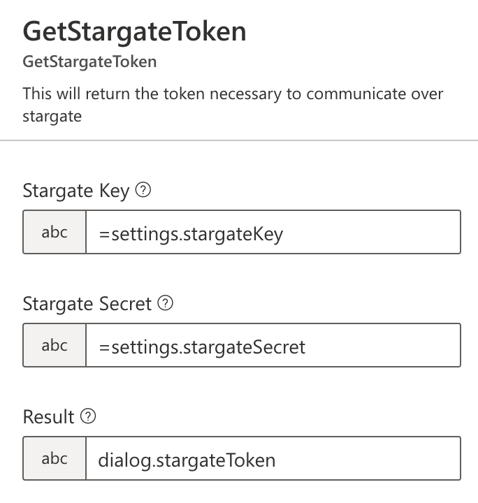

# CAIP Custom Actions

Install this package from NPM to integrate some default custom actions into a Bot built with Bot Composer

## Local build

```bash
npm install
npm run build
```

## Install

```bash
npm install @advanceddevelopment/caip-custom-actions
```

## Functionalities

- Multiply - Basic example of using custom actions accepting 2 numbers and returning the product
- Telemetry - Send Event and Trace telemetry along with ability to flush immediately
- Typing Delay - Blocks the dialog for a certain time with typing indicator
- Get Stargate Token - Generate Stargate token for communication with internal services (supported authType = jwt)
- Stargate API HTTP Request - This Stargate provider intercepts the request and add Oauth bearer token (supported authType = oauth2 and jwt)

## Stargate API HTTP Request

### Capabilities

- fetch the oauth token based on below stargate settings for client_credentials flow
- cache the oauth token to reuse until expiry
- intercept the http request and add bearer token in 'Authorization' header automatically
- reuse the token in http requests until expiry
- renew the token automatically
- retry attempts based on configuration
- supports both oauth2 and jwt stargate auth types

### Getting Started

- add below stargate configuration to appsettings.json

```
  "stargateToken": {
    "URL": "https://stargate-url.optum.com/auth/oauth2/cached/token", // needed for oauth2 flow only
    "clientID": "stargate-client-id",
    "clientSecret": "stargate-client-secret"
  }
```

Optional TokenBodyParams : This is needed when you want to pass extra params to your token API
```
  "stargateToken": {
    "URL": "https://stargate-url.optum.com/auth/oauth2/cached/token", // needed for oauth2 flow only
    "clientID": "stargate-client-id",
    "clientSecret": "stargate-client-secret",
    "tokenBodyParams" : {
      "resource" : "resoruceId",
      "anykey" : "anyvalue"
    }
  }
  }
```

- install @advanceddevelopment/caip-bot-core in your bot

```
    npm install @advanceddevelopment/caip-bot-core
```

- Install/update @advanceddevelopment/caip-custom-actions

  Option #1: using Bot Composer

  

  Option #2: using cmd/shell

  ```
  1. npm install @advanceddevelopment/caip-custom-actions

  2. add following to appsettings
      "components": [
      "@advanceddevelopment/caip-custom-actions"
    ],

  3. update the bot schema by running following command in 'schemas' dir
      Windows: update-schema.ps1
      Linux: update-schema.sh
  ```

- Use/Integration in Bot Composer: click on + icon -> Custom Actions -> Stargate API Http Request



## GetStargateToken

GetStargateToken will need to be called with the following inputs where key and secrets are stored in settings (Fetched via keyvault url parsing)



## GetTranscript

GetTranscript will return the transcript for a conversation. It accepts conversation ID as an optional parameter, if the ID is passed, it will return transcript for that conversation ID otherwise leave it blank to get transcript for current conversation. 

Transcript Store is expected to be configured in the appsettings.json with following schema

```
"runtimeSettings": {
    "features": {
      "blobTranscript": {
        "connectionString": "<<STORAGE_CONNECTION_STRING>>",
        "containerName": "transcriptlogs"
      },
    },
  }
```

## CAIPRatingDialog
Read more on [how to use CAIP Rating Feedback Component](./docs/caip-rating-feedback-comp.md)


## CAIPQuestionnaireDialog
Read more on [how to use CAIP Questionnaire Feedback Component](./docs/caip-questionnaire-feedback-comp.md)
