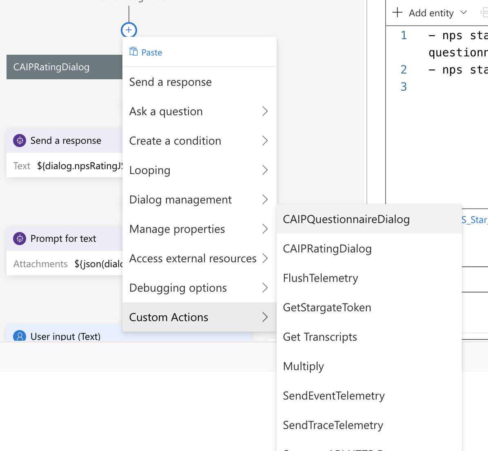
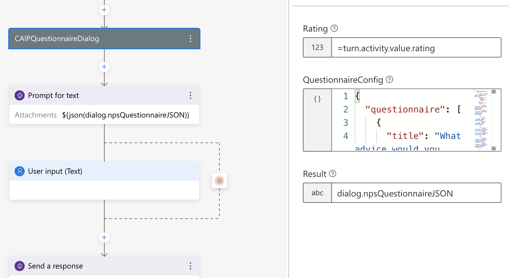
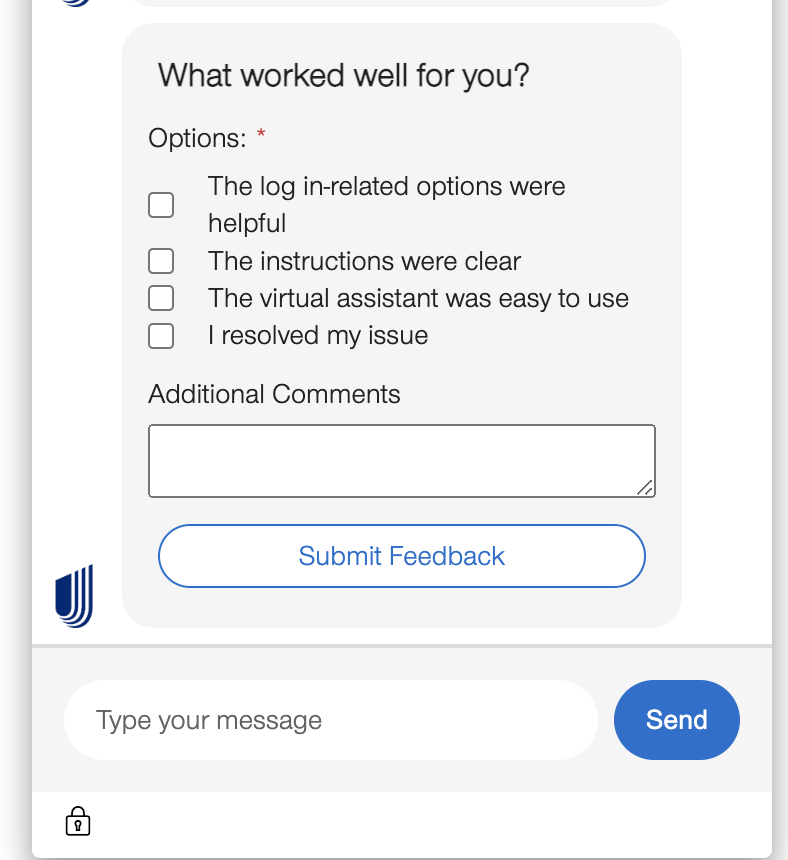

# How to use Questionnaire Feedback Component in Composer

CAIPQuestionnaireDialog will return the AdaptiveCard JSON for rendering the Adaptive Card Questionnaire component in Webchat UI. This is purely meant to have full control at Bot side so there is no extra configuration/code needed at UI to render this rating component.

Please Note : This CAIPQuestionnaireDialog can work along with CAIPRatingDialog component as well as individually based on your business use case.

## Please Follow below process to integrate CAIP Rating Component in your Composer Bot. 

1. Go to your Bot root folder on command line and install CAIP Custom Actions. If already install please upgrade it below required version.
    ```
        npm i @advanceddevelopment/caip-custom-actions@0.0.21
    ```
2. Remove `generated` and schema/`imported` folder.
3. Rebuild the schema by executing below command.
    ```
        npm run build:schema
    ```
4. Open Bot Composer and ad `CAIPQuestionnaireDialog` as Custom Action.

5. Pass below config in QuestionnaireConfig property from Bot Composer if you want to generate JSON for CAIP Questionnaire component.
```
Rating Number : 3
RatingConfig : {
      "questionnaire" : [
          {
              "title" : "What advice would you give us?",
              "range" : {
                  "start" : 1,
                  "end" : 3
              },
              "options" : [
                  {
                      "title": "choice1",
                      "value": "choice1"
                  },
                  {
                      "title": "choice2",
                      "value": "choice2"
                  },
                  {
                      "title": "choice3",
                      "value": "choice3"
                  },
                  {
                      "title": "choice4",
                      "value": "choice4"
                  }
              ]
          },
          {
              "title" : "What worked well for you?",
              "range" : {
                  "start" : 4,
                  "end" : 5
              },
              "options" : [
                  {
                      "title": "choice5",
                      "value": "choice5"
                  },
                  {
                      "title": "choice6",
                      "value": "choice6"
                  }
              ]
          }
      ]
      
  };
```
6. CAIP Questionnaire Component
    1. Composer Settings
    
    
    
    2. Webchat UI Rendering
        1. With Rating Feedback Component
        
        2. Rendering individually
        


## Support
If you face any issue, please drop an email to [CAIP BotBenders](mailto:botbenders@ds.uhc.com)


