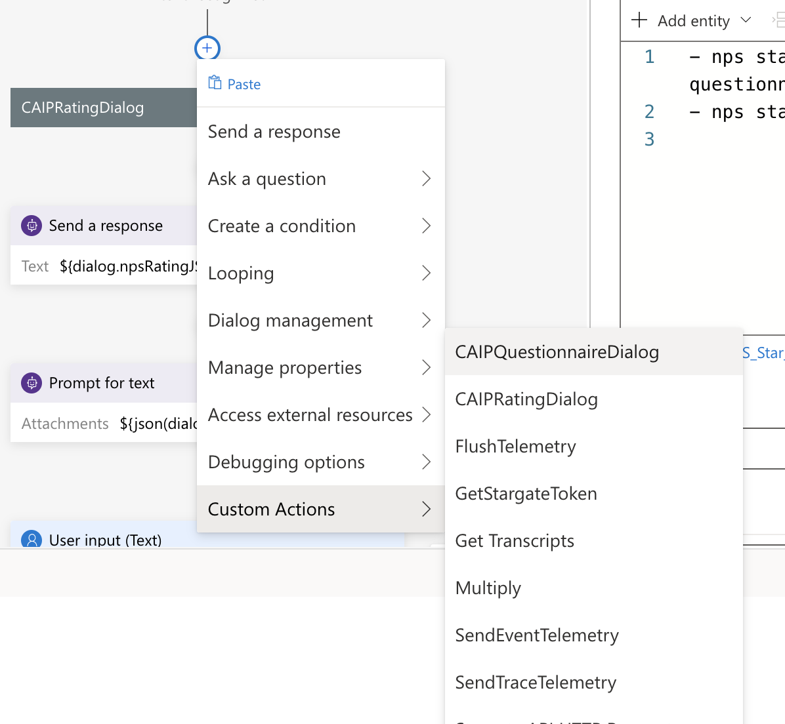
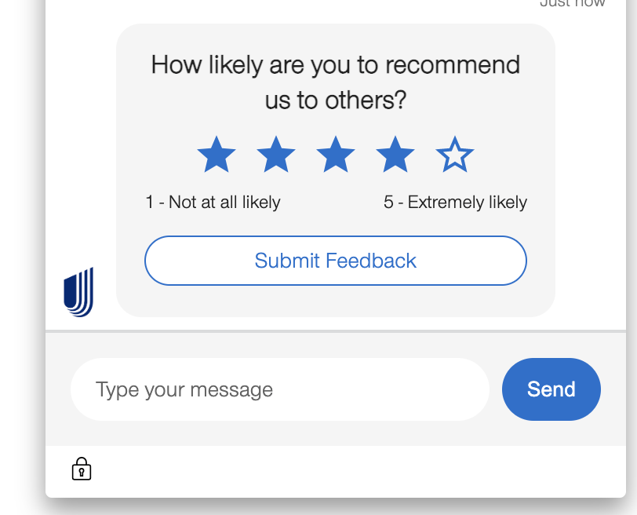

# How to use Rating Feedback Component in Composer

CAIPRatingDialog will return the AdaptiveCard JSON for rendering the Adaptive Card Rating component in Webchat UI. This is purely meant to have full control at Bot side so there is no extra configuration/code needed at UI to render this rating component.

This CAIPRatingDialog supports CAIP Number and CAIP Star Component. You need to pass a config to generate respective JSON.

Please Note : This component can work along with CAIPQuestionnaireDialog component as well as individually based on your business use case.

## Please Follow below process to integrate CAIP Rating Component in your Composer Bot. 

1. Go to your Bot root folder on command line and install CAIP Custom Actions. If already install please upgrade it below required version.
    ```
        npm i @advanceddevelopment/caip-custom-actions@0.0.21
    ```
2. Remove `generated` and schema/`imported` folder.
3. Rebuild the schema by executing below command.
    ```
        npm run build:schema
    ```
4. Open Bot Composer and ad `CAIPRatingDialog` as Custom Action.

5. Pass any one config based on your use case.
    1. If you want to generate JSON for CAIP Number component.
    **Please Note :** This component support numbers range from 0 to 10. you can pass any combination in range object.
    ```
    {
        "type": "RATING_NUMBER",
        "title": "This is title",
        "range": {
          "start": 0,
          "end": 10
        }
    }
    ```
    2. If you want to generate JSON for CAIP Star component.
    **Please Note :** This component support numbers range from 1 to 10. you can pass any combination in range object.
    ```
      {
        "type": "RATING_STAR",
        "title": "This is title",
        "range": {
          "start": 1,
          "end": 5
        }
      }
    ```
6. Composer Settings
    1. Number Rating Component :
        1. Composer Settings
        
        
        
        2. Webchat UI Rendering
        
        
        
    2. Star Rating Component :  
        1. Composer Settings
        
        
        
        2. Webchat UI Rendering
        
        
        


## Support
If you face any issue, please drop an email to [CAIP BotBenders](mailto:botbenders@ds.uhc.com)


